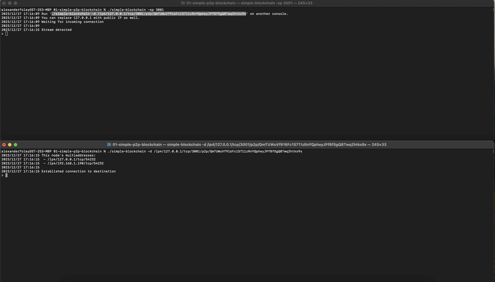
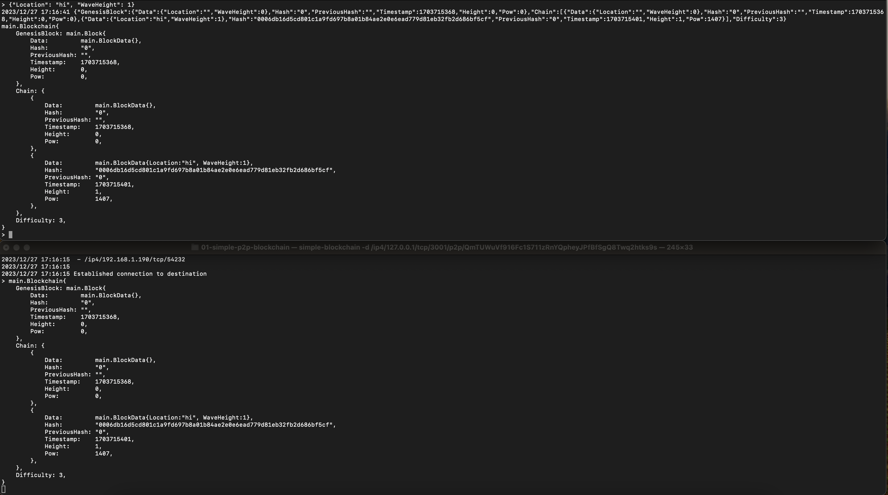
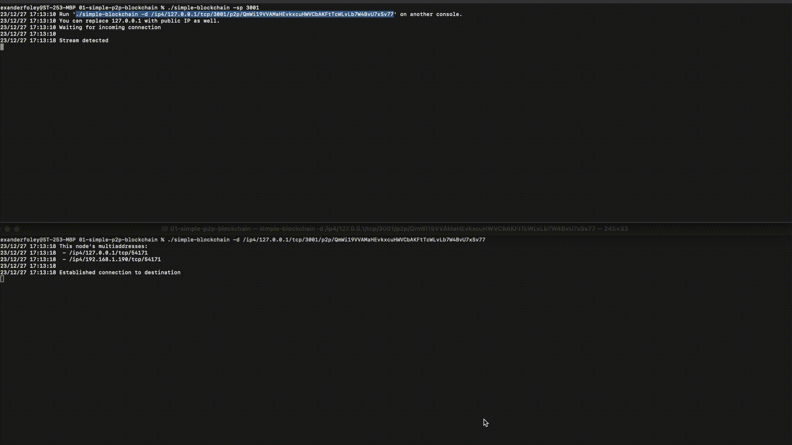

# I Built A Peer 2 Peer Blockchain From Scratch. 'Twas Fun
I'm newish to golang. I'm very new to blockchain. Let's combine the
two and learn something cool. In this article, I'll be building
a Peer-to-peer blockchain system. In the end, we will be able to watch
a transaction flow from one node, through the P2P network, to another node
and watch as the chain grows in size and complexity.

## Background - An Allegory
Imagine a magical notebook that everyone in a town shares. This notebook 
records every transaction or exchange of items that happens among the 
townsfolk. Instead of one person keeping the notebook, everyone in the town has a copy.

Now, let's say Bob wants to buy a bicycle from Alice. When this transaction 
occurs, everyone in the town updates their magical notebook to include this new 
exchange. The notebook keeps a record of who gave what to whom. The townsfolk trust 
this system because they know that no one can cheat or change the records secretly.

Here's the magical part: Once a page in the notebook is full (let's call it a block), it 
gets sealed with a special lock, and the next page references the one before it. So, all 
transactions are not only recorded but also linked in a chain.

Now, if someone tries to be mischievous and change something in the past (like saying they 
gave two bicycles instead of one), it won't work because everyone else has their copies, 
and they will notice the discrepancy.

In our magical town, the notebook is like a blockchain. It's a shared, decentralized 
ledger that records transactions securely and transparently. The blocks are like pages 
in the notebook, and the chain ensures that once something is written, it can't be easily 
altered without everyone noticing.

So, a blockchain, in a way, is like a magical, unforgeable town ledger that everyone 
trusts and uses for all their transactions!

## Background - In Depth
At its core, a blockchain is like a digital ledger or record-keeping 
system that is distributed across a network of computers. It consists of 
a chain of blocks, each containing a list of transactions. Once a block 
is filled with transactions, it is linked to the previous block, 
forming a chain. This chain is maintained by a decentralized network of 
computers, making it secure and resistant to tampering.

So, now that we understand what a blockchain is (more or less), what goes in a block?
We'll, different systems might have different standards for their blocks. But most blocks have
some common data such as:

1. The Block Number (aka height): This is a unique identifier for the block within the blockchain, 
    indicating its position in the chain. We can think of this like an index in a list.
2. Timestamp: The time when the block was added to the chain.
3. Block Hash: The hash of this current block.
4. Previous Block Hash: The hash of the previous block. This links the two blocks together.
5. Transactional Data: This is the data stored on the blockchain. It might be a transaction,
    it might be some sort of health data, it might be temperature data, but it's some data
    that we are recording on the blockchain.

There's also a very important block, which is the first block in the chain. We will
call this the "Genesis Block" to indicate that it is the first and eldest block on the chain.

So, how do various nodes in the network communicate with each other? Well, enter
Peer-to-Peer communications...

## Peer-to-Peer (P2P)
Peer-to-peer (P2P) communication is like friends talking 
directly to each other without needing a middle person. 
Imagine you and your friend sitting in a room, chatting 
and sharing information. In a peer-to-peer system, each 
person (or computer) is like one of those friends – they can 
communicate and share things directly with each other without relying 
on a central authority or a third party.

So, in our system, each node will talk directly with other nodes. In 
simpler terms, each node acts as both a client and a server, able to 
send/receive messages in both directions. Blockchains rely
on P2P communications for a few reasons:

1. Decentralization: In a peer-to-peer network, there is no central 
    authority or intermediary controlling the communication. This is vital for 
    blockchain's goal of decentralization, where power and control are distributed 
    among the participants (peers) in the network. Each node in the network has 
    equal status, contributing to a more democratic and resilient system.
2. Consensus Mechanisms: Many blockchains use consensus mechanisms, such as Proof 
    of Work or Proof of Stake, to agree on the state of the blockchain. Peer-to-peer 
    communication is essential for nodes to reach consensus on the validity of transactions
    and the order of blocks. Nodes communicate to agree on the next block in the chain, 
    ensuring a shared and consistent ledger.
3. Transparency and Trust: Peer-to-peer communication contributes to the transparency 
    of blockchain transactions. Each node has a copy of the entire blockchain, and they 
    can independently verify and validate transactions. This transparency builds trust 
    among participants because they can directly observe and confirm the integrity of 
    the shared ledger.
4. Security: Peer-to-peer communication enhances the security of the blockchain by eliminating 
    single points of control that could be vulnerable to attacks. In a decentralized network, 
    an attacker would need to compromise a significant portion of the network to manipulate 
    the system, making it much more challenging and less attractive for malicious activities.


## Dipping our feet into the code: block.go
Let's first look at how we can hold, construct, and mine a block in our system.

As previously noted, our block will have a few pieces of data within it:

1. Data to record on the blockchain. In our system, our blocks will hold 
    surfing data. We will be keeping track of the recorded locations 
    and the recorded wave heights
2. A block hash, the ID of the block generated using cryptography
    techniques
3. The previous block’s hash is the cryptographic hash of the
    last block in the blockchain. It is recorded in every block to
    link it to the chain and improve its security
4. A timestamp of when the block was created and added to the
    blockchain
5. Height is the index of the block on the chain

The block hash is it's unique identifier. These have to be 100%
unique across the entirety of the blockchain. We can compute this 
in a number of ways (as long as it's unique), but we will concatenate 
and hash the following pieces of data:

1. the previous block's hash
2. the stringified data of the block
3. the current timestamp
4. the block height

Finally, we need to have some way to mine the block.
Mining is essentially adding new blocks to our block chain with a certain
difficulty. In the context of blockchain, difficulty refers to a parameter 
that regulates how challenging it is to add a new block to the blockchain. 
The difficulty level is dynamically adjusted to ensure that the average time 
between the creation of new blocks remains relatively constant. This is crucial for
maintaining the consistency and security of the blockchain.
The difficulty is usually set in such a way that miners,
who are participants in the network responsible for validating
and adding new blocks, need to solve a complex mathematical problem to
create a new block. The difficulty adjusts regularly based on factors such as
the total computational power of the network. If more miners join the
network and the overall computational power increases, the difficulty level
is raised to maintain a consistent block creation time.

```golang
type BlockData struct {
	Location   string
	WaveHeight int
}

type Block struct {
	Data         BlockData
	Hash         string
	PreviousHash string
	Timestamp    int64
	Height       int
	Pow          int
}

func (b Block) calculateHash() string {
	data, _ := json.Marshal(b.Data)
	blockData := b.PreviousHash + string(data) + strconv.FormatInt(b.Timestamp, 10) + strconv.Itoa(b.Height) + strconv.Itoa(b.Pow)
	blockHash := sha256.Sum256([]byte(blockData))
	return fmt.Sprintf("%x", blockHash)
}

func (b *Block) mine(difficulty int) {
	for !strings.HasPrefix(b.Hash, strings.Repeat("0", difficulty)) {
		b.Pow++
		b.Hash = b.calculateHash()
	}
}
```

## Wading waist deep: chain.go
We now have blocks, but how do we begin chaining them together?

Well, let's start with the definition of our chain. 
Our Blockchain Struct will have a few attributes:

1. The genesis block which starts this chain
2. The actual chain itself
3. The difficulty of the chain (for mining more)

We also need a facility to create a new blockchain. When we 
create a new blockchain, we will need to first create its 
genesis block. We will then box up the genesis block, new chain, 
and chain difficulty into a struct which our peers can pass around later.

Additionally, We need a facility to add some structured data to our blockchain.
Our appendBlock function will do just that. It will first take a location
and a wave height from the caller. It will then create a block with that data,
assign it a height, and calculate a hash for it. Then, it will add it to the
blockchain.

Finally, we need a way to maintain or check for integrity within our
blockchain. The validity of chains is one of the main reason to use them. They're 
secure because it should be impossible to tamper with them. So, how do
we tell if we are maintaining our validity and integrity? Well, we will
travers our blockchain. For each block, we can do a few checks:

1. Do the heights make sense? Is the previous blocks height 1 less
    than the current block's height.
2. Do the hashes make sense? Is the current block's the same as it
    originally was when i calculated it?
3. Do the linkages make sense? Is my current block's previous hash
    actually the same as the previous block's hash?

If the answer to any of these is no, then we have an issue and our chain
has become invalid somewhere.

```golang
type Blockchain struct {
	GenesisBlock Block
	Chain        []Block
	Difficulty   int
}

func NewBlockchain(difficulty int) Blockchain {
	genesisBlock := Block{
		Hash:      "0",
		Height:    0,
		Timestamp: time.Now().Unix(),
	}
	return Blockchain{
		genesisBlock,
		[]Block{genesisBlock},
		difficulty,
	}
}

func (b *Blockchain) appendBlock(location string, waveHeight int) {
	blockData := BlockData{
		Location:   location,
		WaveHeight: waveHeight,
	}
	lastBlock := b.Chain[len(b.Chain)-1]
	newBlock := Block{
		Data:         blockData,
		PreviousHash: lastBlock.Hash,
		Timestamp:    time.Now().Unix(),
		Height:       lastBlock.Height + 1,
	}
	newBlock.mine(b.Difficulty)
	b.Chain = append(b.Chain, newBlock)
}

func (b Blockchain) isValid() bool {
	for i := range b.Chain[1:] {
		previousBlock := b.Chain[i]
		currentBlock := b.Chain[i+1]
		if currentBlock.Height != previousBlock.Height+1 {
			log.Println("Bad Height")
			return false
		}
		if currentBlock.Hash != currentBlock.calculateHash() {
			log.Println("Bad Hash")
			return false
		}
		if currentBlock.PreviousHash != previousBlock.Hash {
			log.Println("Bad Prev Hash")
			return false
		}
	}
	return true
}
```

## Diving into the deep end: p2p.go
Let's now dive in to our P2P communications code. I borrowed
this heavily from the [LibP2P docs](https://github.com/libp2p/go-libp2p/tree/master/examples/chat)
and I would definitely suggest looking over the amazing examples
in their github repos.

First, and probably easiest, we will need to make a Peer-to-peer
host. Now, P2P was a bit confusing for me, but I am again extremely grateful
for their great docs and [examples](https://github.com/libp2p/go-libp2p/tree/master/examples/chat)
which served as a ground-work for this P2P blockchain.
This host will be one of the blockchain nodes in the system and other nodes
will be able to latch on to it's networking details and connect to it.

The first thing we do is create an RSA key using a random seed. P2P uses
the public/private key pair to keep our system's secure. We then create
a Multiaddr that listens on 0.0.0.0 and some customizeable port passed in by
the user. Finally, we return a new P2P host by calling the New() function with
our constructed multiaddr and our created private RSA key.


```golang
func makeHost(port int, randomness io.Reader) (host.Host, error) {
	// Creates a new RSA key pair for this host.
	prvKey, _, err := crypto.GenerateKeyPairWithReader(crypto.RSA, 2048, randomness)
	if err != nil {
		log.Println(err)
		return nil, err
	}

	// 0.0.0.0 will listen on any interface device.
	sourceMultiAddr, _ := multiaddr.NewMultiaddr(fmt.Sprintf("/ip4/0.0.0.0/tcp/%d", port))

	// libp2p.New constructs a new libp2p Host.
	// Other options can be added here.
	return libp2p.New(
		libp2p.ListenAddrs(sourceMultiAddr),
		libp2p.Identity(prvKey),
	)
}
```

Next, we need a way to handle incoming streams. These streams will
be instantiated when another node connects to this current node. If the
nodes want to be able to send/receive data, we need to handle both the
inbound and outbound data packets of the stream.

Our stream is bi-directional, so we need to create a ReadWriter to handle
both directions. We also want to handle the reading/writing concurrently,
so we need to put them on separate go routines.

As a note, most of our business logic will go into those readData and
writeData functions. Up until now, we've more or less been following the
examples on the LibP2P GitHub page.

```golang
func handleStream(s network.Stream) {
	log.Println("Stream detected")

	// Create a buffer stream for non-blocking read and write.
	rw := bufio.NewReadWriter(bufio.NewReader(s), bufio.NewWriter(s))

	go readData(rw)
	go writeData(rw)

	// stream 's' will stay open until you close it (or the other side closes it).
}
```

Let's look at how we read data from the stream and add blocks
to our block chain. We read a string from the stream up the a new line character.
If we get an EOF error, we can assume the stream is closed and return. If we get
an empty string, we can just skip to the next loop iteration.
However, if we successfully read data from the stream, then we should try to
unmarshal it into a blockchain object.

In block-chain land, the length of the chain is king. If the incoming chain is longer
than our chain, we should assume that the new chain is the most up-to-date
statement of record and we should essentially discard our chain for the incoming
chain.

Finally, we just use the `pretty` package to dump out our chain to the screen.

```golang
func readData(rw *bufio.ReadWriter) {
	for {
		str, err := rw.ReadString('\n')

		// If the channel is closed or we get an EOF, return
		if err == io.EOF {
			return
		}

		if str == "" {
			continue
		}

		if str != "\n" {
			var chain Blockchain
			if err := json.Unmarshal([]byte(str), &chain); err != nil {
				log.Println(err)
				continue
			}

			mutex.Lock()
			if len(chain.Chain) > len(mychain.Chain) {
				mychain = chain
				pretty.Println(mychain)
			}
			mutex.Unlock()
		}

	}
}
```

We have a way to read data from the stream, but how about
writing data to the stream? Enter writeData. This function
will read data from standard input (os.Stdin). It will then
unmarshal it from a string to a `UserMessage` object.
It will then create a block from this message, validate it, and
write the updated chain to the stream.

```golang

type UserMessage struct {
	Location   string
	WaveHeight int
}

func writeData(rw *bufio.ReadWriter) {

	stdReader := bufio.NewReader(os.Stdin)

	for {
		fmt.Print("> ")
		sendData, err := stdReader.ReadString('\n')
		if err != nil {
			log.Fatal(err)
		}

		sendData = strings.Replace(sendData, "\n", "", -1)
		var userMsg UserMessage

		if err := json.Unmarshal([]byte(sendData), &userMsg); err != nil {
			log.Println(err)
			continue
		}

		mutex.Lock()
		mychain.appendBlock(userMsg.Location, userMsg.WaveHeight)
		if !mychain.isValid() {
			pretty.Println(mychain)
			log.Println("Chain isn't valid anymore! Help meee!")
			return
		}
		mutex.Unlock()

		bytes, err := json.Marshal(mychain)
		log.Println(string(bytes))
		if err != nil {
			log.Println(err)
		}

		pretty.Println(mychain)

		mutex.Lock()
		rw.WriteString(fmt.Sprintf("%s\n", string(bytes)))
		rw.Flush()
		mutex.Unlock()
	}

}
```

We also have two functions to start our nodes: `startPeer` and `startPeerAndConnect`.
`startPeer` will be used to start a node on it's own. It will
set the stream handler for the host and then print out it's connection
details to stdout so that other peers can connect directly to it.

`startPeerAndConnect` is similar except it will initiate connections
with the destination multiaddr we specify on the command line. So, 
in this case, we assume that at least one node is already running 
and we will connect directly to it.

```golang

func startPeer(ctx context.Context, h host.Host, streamHandler network.StreamHandler) {
	// Set a function as stream handler.
	// This function is called when a peer connects, and starts a stream with this protocol.
	// Only applies on the receiving side.
	h.SetStreamHandler("/chat/1.0.0", streamHandler)

	// Let's get the actual TCP port from our listen multiaddr, in case we're using 0 (default; random available port).
	var port string
	for _, la := range h.Network().ListenAddresses() {
		if p, err := la.ValueForProtocol(multiaddr.P_TCP); err == nil {
			port = p
			break
		}
	}

	if port == "" {
		log.Println("was not able to find actual local port")
		return
	}

	log.Printf("Run './simple-blockchain -d /ip4/127.0.0.1/tcp/%v/p2p/%s' on another console.\n", port, h.ID())
	log.Println("You can replace 127.0.0.1 with public IP as well.")
	log.Println("Waiting for incoming connection")
	log.Println()
}

func startPeerAndConnect(ctx context.Context, h host.Host, destination string) (*bufio.ReadWriter, error) {
	log.Println("This node's multiaddresses:")
	for _, la := range h.Addrs() {
		log.Printf(" - %v\n", la)
	}
	log.Println()

	// Turn the destination into a multiaddr.
	maddr, err := multiaddr.NewMultiaddr(destination)
	if err != nil {
		log.Println(err)
		return nil, err
	}

	// Extract the peer ID from the multiaddr.
	info, err := peer.AddrInfoFromP2pAddr(maddr)
	if err != nil {
		log.Println(err)
		return nil, err
	}

	// Add the destination's peer multiaddress in the peerstore.
	// This will be used during connection and stream creation by libp2p.
	h.Peerstore().AddAddrs(info.ID, info.Addrs, peerstore.PermanentAddrTTL)

	// Start a stream with the destination.
	// Multiaddress of the destination peer is fetched from the peerstore using 'peerId'.
	s, err := h.NewStream(context.Background(), info.ID, "/chat/1.0.0")
	if err != nil {
		log.Println(err)
		return nil, err
	}
	log.Println("Established connection to destination")

	// Create a buffered stream so that read and writes are non-blocking.
	rw := bufio.NewReadWriter(bufio.NewReader(s), bufio.NewWriter(s))

	return rw, nil
}
```

## Tying it all together: main.go
We can now tie everything together in our `main.go`

We initialize a global mutex for the blockchain
and then we initialize the blockchain

We then pull out the flags passed in by the user (see the running section below).
We use our `makeHost` function to create a new node. If this is running without
any predefined nodes (no -d flag), then we use the `startPeer` function to wait for
and handle incoming streams. If there is a predefined node (there is a -d flag),
we initiate that connection and begin the reading/writing from the predefined node.
Finally, we just wait forever for the program to terminate.

```golang
var mutex = &sync.Mutex{}
var mychain = NewBlockchain(3)


func main() {
	ctx, cancel := context.WithCancel(context.Background())
	defer cancel()

	sourcePort := flag.Int("sp", 0, "Source port number")
	dest := flag.String("d", "", "Destination multiaddr string")
	help := flag.Bool("help", false, "Display help")
	debug := flag.Bool("debug", false, "Debug generates the same node ID on every execution")

	flag.Parse()

	if *help {
		fmt.Printf("This program demonstrates a simple p2p blockchain application\n\n")
		fmt.Println("Usage: Run './simple-blockchain -sp <SOURCE_PORT>' where <SOURCE_PORT> can be any port number.")
		fmt.Println("Now run './simple-blockchain -d <MULTIADDR>' where <MULTIADDR> is multiaddress of previous listener host.")

		os.Exit(0)
	}

	// If debug is enabled, use a constant random source to generate the peer ID. Only useful for debugging,
	// off by default. Otherwise, it uses rand.Reader.
	var r io.Reader
	if *debug {
		// Use the port number as the randomness source.
		// This will always generate the same host ID on multiple executions, if the same port number is used.
		// Never do this in production code.
		r = mrand.New(mrand.NewSource(int64(*sourcePort)))
	} else {
		r = rand.Reader
	}

	h, err := makeHost(*sourcePort, r)
	if err != nil {
		log.Println(err)
		return
	}

	if *dest == "" {
		startPeer(ctx, h, handleStream)
	} else {
		rw, err := startPeerAndConnect(ctx, h, *dest)
		if err != nil {
			log.Println(err)
			return
		}

		// Create a thread to read and write data.
		go writeData(rw)
		go readData(rw)

	}

	// Wait forever
	select {}
}
```

## Running

Let's build and run our go code!

```shell
alexanderfoley@ST-253-MBP simple-p2p-blockchain % go build
2023/12/27 17:11:45 Run './simple-blockchain -d /ip4/127.0.0.1/tcp/3001/p2p/Qmcx32jQF2pTonNhhVf2Q4UdJzgtrPibRDz4of86cBRbiL' on another console.
2023/12/27 17:11:45 You can replace 127.0.0.1 with public IP as well.
2023/12/27 17:11:45 Waiting for incoming connection
2023/12/27 17:11:45 

```

Let's open another console and run the command our log statement tells us to:
```shell
alexanderfoley@ST-253-MBP 01-simple-p2p-blockchain % ./simple-blockchain -d /ip4/127.0.0.1/tcp/3001/p2p/Qmcx32jQF2pTonNhhVf2Q4UdJzgtrPibRDz4of86cBRbiL
2023/12/27 17:12:08 This node's multiaddresses:
2023/12/27 17:12:08  - /ip4/127.0.0.1/tcp/54146
2023/12/27 17:12:08  - /ip4/192.168.1.190/tcp/54146
2023/12/27 17:12:08 
2023/12/27 17:12:08 Established connection to destination
> 

```

And finally, let's add a block to our blockchain:
```shell
> {"Location": "hi", "WaveHeight": 1}
2023/12/27 17:12:26 {"GenesisBlock":{"Data":{"Location":"","WaveHeight":0},"Hash":"0","PreviousHash":"","Timestamp":1703715104,"Height":0,"Pow":0},"Chain":[{"Data":{"Location":"","WaveHeight":0},"Hash":"0","PreviousHash":"","Timestamp":1703715104,"Height":0,"Pow":0},{"Data":{"Location":"hi","WaveHeight":1},"Hash":"000c95abacd3d6e1d3dc594fb0c68dd9a470fd180473a9946c7b325d79a4e994","PreviousHash":"0","Timestamp":1703715146,"Height":1,"Pow":1355}],"Difficulty":3}
main.Blockchain{
    GenesisBlock: main.Block{
        Data:         main.BlockData{},
        Hash:         "0",
        PreviousHash: "",
        Timestamp:    1703715104,
        Height:       0,
        Pow:          0,
    },
    Chain: {
        {
            Data:         main.BlockData{},
            Hash:         "0",
            PreviousHash: "",
            Timestamp:    1703715104,
            Height:       0,
            Pow:          0,
        },
        {
            Data:         main.BlockData{Location:"hi", WaveHeight:1},
            Hash:         "000c95abacd3d6e1d3dc594fb0c68dd9a470fd180473a9946c7b325d79a4e994",
            PreviousHash: "0",
            Timestamp:    1703715146,
            Height:       1,
            Pow:          1355,
        },
    },
    Difficulty: 3,
}
> 
```

Let's put some image's side-by-side so its a bit easier to see:


