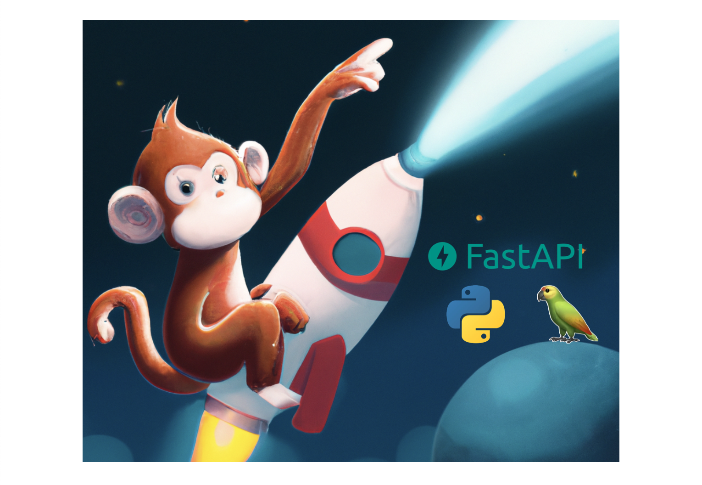
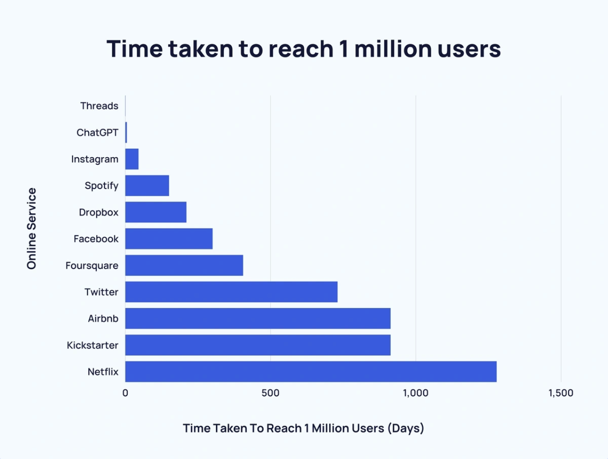
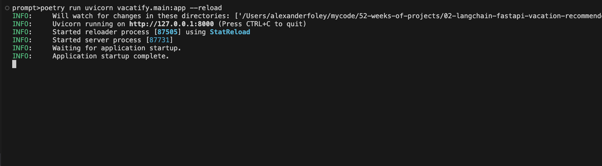
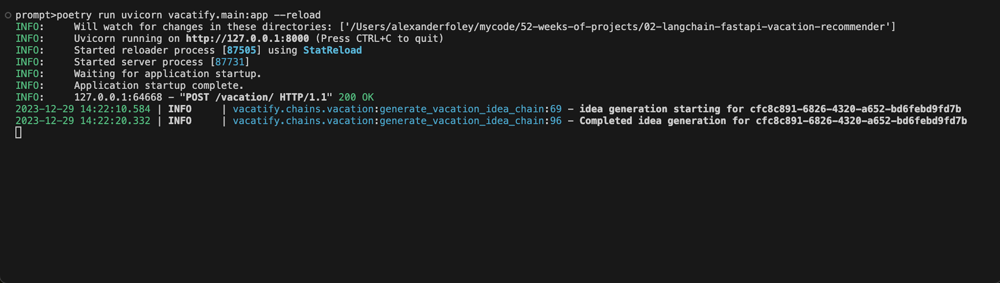
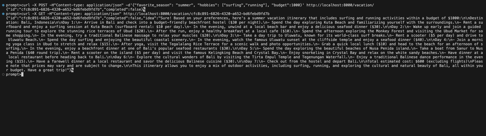

# Hosting Langchain With FastAPI - Vacation Planner Project



Large language models, like ChatGPT, Llama, etc., have taken
the world by storm over the past 12 months. If you don't believe me,
let's take a look at how long it took ChatGPT to get to 1 million 
users as compared to some other behemoths. Graph is courtesy
of [exploding topics](https://explodingtopics.com/blog/chatgpt-users).



Looking at this, we can see it took chatGPT 5 days to get to 1 million users.
Netflix took almost 4 years to get there. Now, I know that times have changed
and the internet era has boomed which helps these companies grow. But still,
5 days, REALLY?!

LLMs in general have become applicable to almost every single industry from 
health care to finance. If you're in any industry that has been impacted by
LLMs, it's probably a good idea to learn one or two things about them. If
you're like me, who writes software for a living, it's a good idea to know
how to use it and what some of the stuff means.

As always, breaking in to a new field is so difficult because you have to cut through
the technical jargon, find the right place to start, and find a way
to learn the new tech so that you don't feel obsolete. I don't know how you
learn best, but I am a learn-by-doer. I like to combine something I know
really well with something I don't. By doing that, I see where the new
puzzle piece fits into my overall puzzle (my brain).

That's exactly what I'm doing today. I've written hundreds of APIs in
python using almost every framework under the sun (Django, flask, tornado, you name it).
So, I'm going to combine that with something that's a bit newer to me - Langchain.
I've done a few courses in Langchain and I've watched some videos on it but, I'm still
learning, and I want to become production ready!

So, let's get started by introducing our stars of the show: FastAPI and Langchain.

## What Is FastAPI
FastAPI is a modern, fast (as the name implies), web framework for building APIs with 
Python. It is designed to be easy to use, efficient, and highly performant, 
leveraging the power of Python type hints for automatic data validation and 
documentation generation. Asynchronous programming is a core feature, allowing for 
high concurrency and scalability.

## What Is LangChain
Langchain, on the other hand, is a framework for developing applications powered by 
language models. It is designed to let you effortlessly plug in to an LLM and
enables users to provide extra context to the LLM. Simply put, LangChain enables LLM 
models to generate responses based on the most up-to-date information available online, 
in documents, or from other data sources.

## Installing
Both FastAPI and Langchain are python packages, so they can be pip installed:

```shell
prompt> pip install fastapi langchain
```

But there are a lot of supporting libraries that are useful in this project, so
I have included a [requirements.txt](https://github.com/afoley587/52-weeks-of-projects-2024/blob/afoley/02-langchain-fastapi-vacation-recommender/02-langchain-fastapi-vacation-recommender/requirements.txt) 
that you can get off and running with.

## Part 0 - File Structure

First, let's look at our file structure:
```shell
.
├── requirements.txt
└── vacatify
    ├── __init__.py
    ├── chains
    │   ├── __init__.py
    │   └── vacation.py
    ├── main.py
    ├── routes
    │   ├── __init__.py
    │   └── vacation.py
    └── schemas.py
```

Let's also give a high level overview of the files/directories in this tree. 
I will omit the `__init__.py` files from the description.

1. `vacatify`: The root level of our python package
2. `chains`: We will add our langchain logic in here. For example, we will generate
    and format prompts around vacations in the `vacation.py` file. We will then submit 
    these prompts to langchain, let it query the LLM, and save it's response.
3. `main.py`: This will be our application's entrypoint. It will start the server, 
    attach the API routes, etc.
4. `routes`: These will be the routes within our application. So, `vacation.py` will
    house the HTTP endpoints which pertain to adding a new vacation idea.
5. `schemas.py`: This file will house the request/response/pydantic schemas we want to 
    be able to use within our API.

## Part I - Building the API

### schemas.py
Let's start with the schemas so we know what our API is passing around.

The `GenerateVacationIdeaResponse` is what
we will return to a user that says the 
idea is currently being generated. Langchain might take
some time to generate the response, and we don't want users
to have to wait forever for their HTTP call to return. Because
of this, we will use background tasks (more on that later!)
and users can check in to see if their idea is finished after a 
few seconds.

The `GenerateVacationIdeaResponse` reflects this with two fields:

1. An ID field which will allow them to query our API for UUID of the
    project
2. A completed field which tells the user whether the idea generation
    is finished or not.

The `GetVacationIdeaResponse` is what we will return to a 
user when they query for the idea or its status. After
a few seconds, the user will say "Hm, is the idea done yet?"
and can query our API.
The `GetVacationIdeaResponse` has the same fields as `GenerateVacationIdeaResponse`,
but adds an idea field which is what the LLM will fill out when 
the generation is completed.

The `GenerateVacationIdeaRequest` is what a user will
provide to us so we can create a vacation idea for them.
We will expect them to tell us their favorite season,
any hobbies they may have, and what their vacation budget is.
We can feed these in to the LLM down the line.


The `Vacation` object will more or less be a data class for us.
It is identical to `GetVacationIdeaResponse`, but I sometimes
find it useful to have separate models for separate portions
of the stack so code is easier to maintain/modify later.

```python
from pydantic import BaseModel, Field
from typing import List
import uuid


class GenerateVacationIdeaResponse(BaseModel):
    id: uuid.UUID = Field(description="ID Of the generated idea")
    completed: bool = Field(
        description="Flag indicating if the generation was completed"
    )


class GetVacationIdeaResponse(GenerateVacationIdeaResponse):
    idea: str = Field(description="The generated idea")


class GenerateVacationIdeaRequest(BaseModel):
    favorite_season: str = Field(description="Your favorite season")
    hobbies: List[str] = Field(description="The hobbies you enjoy")
    budget: int = Field(description="The budget for your vacation")


class Vacation(GenerateVacationIdeaResponse):
    idea: str = Field(description="The generated idea")
```

## routes/vacation.py
Now that we have our schemas defined and we know what our data objects
will look like, we can begin to write a router that will interact with
these objects (creating them, returning them, etc.)

The `vacation_router` is the router that will be used
by the main application. All of the endpoints on the router
will therefore be added to the application so we can 
begin to leverage them!

The first endpoint we will add is a POST endpoint at
`http://the-api-ip:the-api-port/vacation/`. The main purposes
of this endpoint are to:

1. Start a new background task to create a vacation idea for you
2. Report the created ID and progress back to the user

We can also see that this endpoint takes, as input, a request
of type `GenerateVacationIdeaRequest` and returns a response
of type `GenerateVacationIdeaResponse`. These data types were
defined above in our schemas section. Thankfully, fastAPI does
all of the required serialization both to and from the API!

This method also leverages a FastAPI notion called BackgroundTasks.
We can define background tasks to be run after returning a response.
This is useful because, at time, Langchain might take a while to run.
You don't want your clients to have to handle huge timeouts beacuse that
might indicate other issues. By scheduling these as background tasks, we can
say "hey client, the work has started. Check back later :)"

So, let's look more in depth at `generate_vacation()`. First, 
we generate a UUID for the idea. Then, we submit the chain
with all of the parameters from our user to our background task.
The observant reader will see the function `generate_vacation_idea_chain`.
This is the function that will run langchain and update our vacation
database. We will talk in more depth about it in a following section.
Finally, we return the response with the ID and the completed 
flag set to false.

Our second endpoint is a GET endpoint at
`http://the-api-ip:the-api-port/vacation/<id>`. The main
purpose of this endpoint is going to be use to either 
poll/query/read the idea that was created from the generation above.

We can see that is accepts a UUID id as a parameter and returns a 
`GetVacationIdeaResponse` which was again defined in our schema sections
above.

We can see that this endpoint just looks to see if a vacation ID matching
the requested ID is present in our vacation "database". I say database in
quotes because this is just a dictionary that is shared across the system.
Ideally, this would be some more persistent/stable/scalable form of storage
but, for the purpose of this conversation, a dictionary is perfect.

If we know the ID that the user is requesting, we can put all the relevant
data into a `GetVacationIdeaResponse` and return it to the user. Otherwise,
we throw a 404.

So, up to now, we have a router with two endpoints:

1. A `POST` to generate new ideas
2. A `GET` to read the generated ideas

```python
import uuid

from fastapi import APIRouter, Request, BackgroundTasks, HTTPException

from vacatify.schemas import (
    GenerateVacationIdeaResponse,
    GetVacationIdeaResponse,
    GenerateVacationIdeaRequest,
)

from vacatify.chains.vacation import generate_vacation_idea_chain, vacations

vacation_router = APIRouter(prefix="/vacation")


@vacation_router.post(
    "/",
    summary="Generate a vacation idea.",
    responses={
        201: {"description": "Successfully initiated task."},
    },
)
async def generate_vacation(
    r: GenerateVacationIdeaRequest, background_tasks: BackgroundTasks
) -> GenerateVacationIdeaResponse:
    """Initiates a vacation generation for you."""

    idea_id = uuid.uuid4()
    background_tasks.add_task(
        generate_vacation_idea_chain,
        idea_id,
        r.favorite_season,
        r.hobbies,
        r.budget,
    )
    return GenerateVacationIdeaResponse(id=idea_id, completed=False)


@vacation_router.get(
    "/{id}",
    summary="Get the generated a vacation idea.",
    responses={
        200: {"description": "Successfully fetched vacation."},
        404: {"description": "Vacation not found."},
    },
)
async def get_vacation(r: Request, id: uuid.UUID) -> GetVacationIdeaResponse:
    """Returns the vacation generation for you."""
    if id in vacations:
        vacay = vacations[id]
        return GetVacationIdeaResponse(
            id=vacay.id, completed=vacay.completed, idea=vacay.idea
        )
    raise HTTPException(status_code=404, detail="ID not found")

```

## main.py

We can now add the routes to our fastAPI application in our `main.py` file:.

First, we instantiate a new application and we just attach the router to it. 
All of the `/vacation/` endpoints will be automatically added to our app.

```python
from fastapi import FastAPI

from vacatify.routes.vacation import vacation_router

app = FastAPI()
app.include_router(vacation_router)
```

## Part II - Building the Chain

### chains/vacation.py

The scene has been set with the API. Now, we need a way 
to converse with our LLM (or at least as it questions).

Let's redefine our vacation "database". As previously noted, I say database in
quotes because this is just a dictionary that is shared across the system.
Ideally, this would be some more persistent/stable/scalable form of storage
but, for the purpose of this conversation, a dictionary is perfect.

`generate_vacation_idea_chain` is where we finally start to invoke langchain.
It takes a few parameters:

1. The UUID which was passed in from our router. We will use this to save the
    results in our vacation database.
2. The users preferred season. We will use that as a parameter to the langchain chain.
3. The users favorite hobbies. We will use that as a parameter to the langchain chain.
4. The users financial budget. We will use that as a parameter to the langchain chain.

First, we create a system template and system message to pass to the LLM. A 
A system message is an instruction or information provided by the application or 
system to guide the conversation. The system message helps set the context and
instructions for the LLM and will guide how it responds to the human prompt.
A system template is just a templated form of the message.

A human message and template are the same idea. 

We can think of this like a chat application. The system prompt helps set 
up the chatbot. The human prompt is what the user would ask it.

Now that the templates are established, we can create a prompt from them
using the `from_template` methods. Next, we begin to intiialize the 
prompt template from the system message and the human message.

We can think of this as setting the scene for our chatbot: we gave them
a generic system message, we gave them a generic human message, and now
we can ask the LLM to respond to the prompts. 

To accomplish that, we have to use the `from_messages` method to begin
our chat conversation and then use `format_prompt` so that the prompt
gets formatted into text that the LLM will understand and that contains
all of the required context. 

Finally, we can chall our chain with `chat(request)` which submits the
formatted chat prompt to the LLM. When the LLM is done responding, we
can update our vacation database.

By this time, the user can then begin to query and read the response from the LLM
over the HTTP API.
```python
import uuid
from typing import List

from langchain.chat_models import ChatOpenAI
from langchain.prompts import (
    ChatPromptTemplate,
    SystemMessagePromptTemplate,
    HumanMessagePromptTemplate,
)
from loguru import logger

from vacatify.schemas import Vacation

vacations = {}


async def generate_vacation_idea_chain(
    id: uuid.UUID, season: str, hobbies: List[str], budget: int
):
    logger.info(f"idea generation starting for {id}")
    chat = ChatOpenAI()
    system_template = """
    You are an AI travel agent that will help me create a vacation idea.
    
    My favorite season is {season}.

    My hobbies include {hobbies}.

    My budget is {budget} dollars.
    """
    vacations[id] = Vacation(id=id, completed=False, idea="")

    system_message_prompt = SystemMessagePromptTemplate.from_template(system_template)
    human_template = "{travel_request}"
    human_message_prompt = HumanMessagePromptTemplate.from_template(human_template)
    chat_prompt = ChatPromptTemplate.from_messages(
        [system_message_prompt, human_message_prompt]
    )
    request = chat_prompt.format_prompt(
        season=season,
        budget=budget,
        hobbies=hobbies,
        travel_request="write a travel itinerary for me",
    ).to_messages()
    result = chat(request)
    vacations[id].idea = result.content
    logger.info(f"Completed idea generation for {id}")
```

Now, we have a langchain chain. It gets invoked as a background task by our
API. And when it's finished, it updated our vacation database.

## Part III - Running And Testing

All of the pieces are built - let's run it! Let's open
two terminals:

1. One to run the API
2. One to run cURL calls to the API

In the first terminal, let's run our API: `uvicorn vacatify.main:app --reload`



In the second terminal, let's run a cURL call with our parameters: `curl -X POST -H"Content-type: application/json" -d'{"favorite_season": "summer", "hobbies": ["surfing","running"], "budget":1000}' http://localhost:8000/vacation/`


If we flip back to our first terminal, we can see that the idea generation starts and eventually
finishes.



In our second terminal, let's see what the LLM thinks we should do: `curl -X GET -H"Content-type: application/json" http://localhost:8000/vacation/cfc8c891-6826-4320-a652-bd6febd9fd7b`.
Note that the UUID (`fc8c891-6826-4320-a652-bd6febd9fd7b`) will vary between your system and
mine!



I hope you liked following along! Please feel free to read all of my code
[here](https://github.com/afoley587/52-weeks-of-projects-2024/tree/afoley/02-langchain-fastapi-vacation-recommender/02-langchain-fastapi-vacation-recommender) on github!