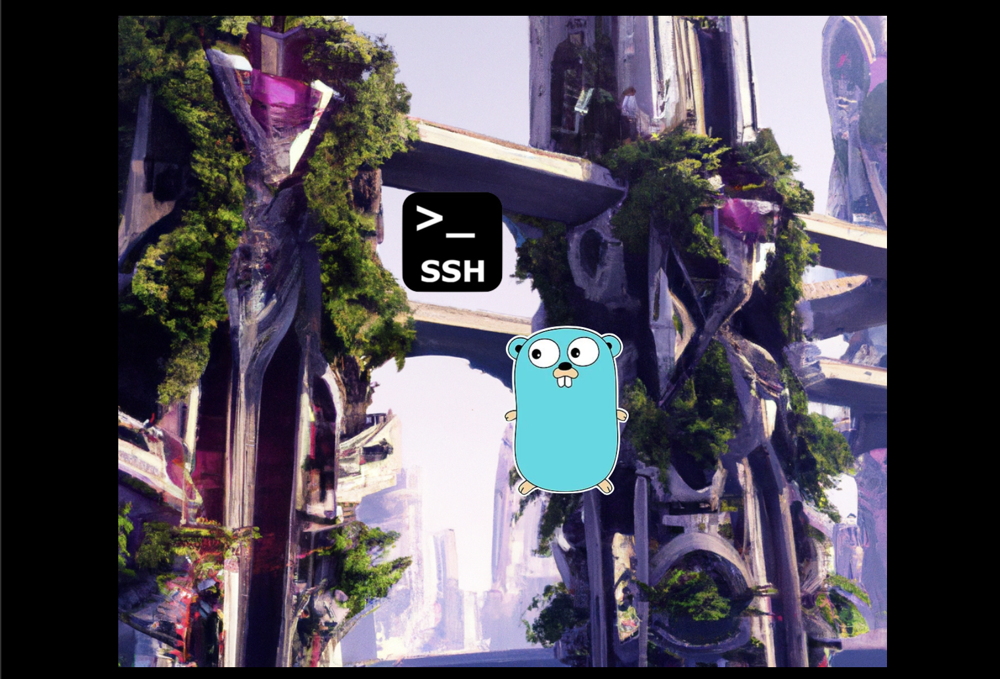
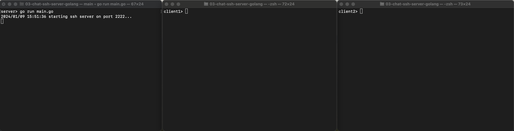
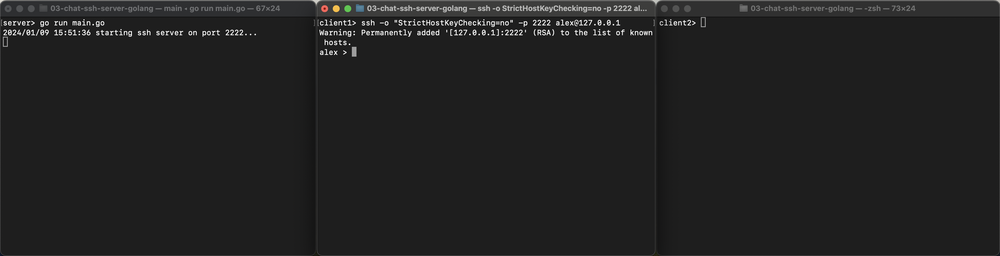
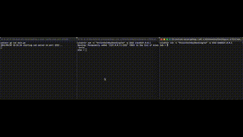

# Building An SSH Chatroom With Go



## Background
2024 is my year of growth and knowledge. I am dedicated to doing
one technical project a week. A prime focus of my learning will 
be dedicated to a language that I am really falling in love with:
[golang](https://go.dev/).

To help facilitate my learning, I am building an SSH chat server
with go. Our server will be able to do a few things:

1. A user will be able to SSH into our server
2. A user will be able to list the available rooms
3. A user will be able to enter a chatroom and then send/receive messages
    to/from the chatroom


## Supporting Libraries

We will be utilizing the following two libraries in building our chat
server:

1. [`github.com/gliderlabs/ssh`](github.com/gliderlabs/ssh): This library will
    help us serve the server as well as handle incoming connections.
2. [`golang.org/x/crypto/ssh/terminal`](golang.org/x/crypto/ssh/terminal): This
    library will help us create/read/write to PTY terminals for the users 
    that SSH in to the server.

We can install them with `go get`:

```shell
go get github.com/gliderlabs/ssh
go get golang.org/x/crypto/ssh/terminal
```

## rooms.go
First, let us look at the structs that our rooms package will use
to keep track of data. In our system, a chatroom will be an object 
which keeps track of users in the chatroom, the messages that have
been sent, and will help facilitate the delivery of messages to all
of the users in the room.

The Room struct will have a few pieces of data associated with it.
 1. The name of the room: This will be a string identifier to show
    to users when they use the /enter command.
 2. The chat history of the room. The room will keep all of its chat
    history in memory. When a new user joins, it can then show them
    the entire history of the chatroom so they can feel caught-up.
 3. The users currently in the chatroom. This way, the system can
    notify the users of new messages and keep a record of who is
    currently logged in to the room.

As previously said, the room needs to keep track of two things:
users and messages. So, what's in a user? Well, our User struct
will be comprised of an SSH Session and the associated PTY terminal.
The SSH Session gives us underlying session information like the
username while the terminal gives us a nice way to send and
receive messages from the user. The message struct, on the other hand,
just needs to keep track of the sending user and the actual message.

```golang
type Room struct {
	Name    string
	History []Message
	Users   []User
}

type User struct {
	Session  ssh.Session
	Terminal *terminal.Terminal
}

type Message struct {
	From    string
	Message string
}
```

So, now that our room is established, what kind of things should the room
be able to do? Well, I think our room should allow users to do three things:
1. Enter the room
2. Leave the room
3. Send messages to the room

Let's first look at our Enter function. This is the function that will be
called when a user uses the /enter command after logging in. We see
that the first thing we do is make a User object out the users
session and terminal. The observant reader will notice we don't do
any checking to see if the user is already in the room. This is mainly
because we force users to leave rooms before joining new ones, and this
is enforced one layer up.

The second thing our Enter function does is add the new user to the
room's user slice. Then the room sends them a message and sends them
all of the messages in its history.

Let us turn our attention to leaving a room. Once a user has decided
that they want to go to another chatroom, they will call the Leave
function to remove them from this current room. All our leave function
has to do is remove them from the user slice. Note that we remove
users by username so, if two people were to be logged into the same
account, some funky behavior might happen. As of now, the system
doesn't enforce that but, it would be a good idea to!

Finally, a user has to be able to send messages to other users. They
do that by typing in their terminal. First, we create a message
object with their username as the From attribute and the string
they typed as the Message attribute. The message then get's appended
to the rooms history and sent out to all of the other users.

```golang
func (r *Room) Enter(sess ssh.Session, term *terminal.Terminal) {
	u := User{Session: sess, Terminal: term}
	r.Users = append(r.Users, u)
	entryMsg := Message{From: r.Name, Message: "Welcome to my room!"}
	send(u, entryMsg)
	for _, m := range r.History {
		send(u, m)
	}
}

func (r *Room) Leave(sess ssh.Session) {
	r.Users = removeByUsername(r.Users, sess.User())
}

func (r *Room) SendMessage(from, message string) {

	messageObj := Message{From: from, Message: message}
	r.History = append(r.History, messageObj)
	for _, u := range r.Users {
		if (u.Session.User()) != from {
			send(u, messageObj)
		}
	}
}

func removeByUsername(s []User, n string) []User {
	var index int
	for i, u := range s {
		if u.Session.User() == n {
			index = i
			break
		}
	}
	return append(s[:index], s[index+1:]...)
}

func send(u User, m Message) {
	raw := m.From + "> " + m.Message + "\n"
	u.Terminal.Write([]byte(raw))
}
```

## main.go

Now that our rooms package has been established, we need to use it!

First, we will want to keep track of a few things:

1. The sessions we have and which rooms they are in. This will help us make sure
    that the user is sending messages to the right room and will also make sure that
    a user leaves their current room before hopping to another room.
2. The available rooms that we can offer to users. We will be able to show users
    which rooms are available, but also helps us keep track of who is where.

We also define a few supported commands:

* `/enter <room>` will allow a user to enter a room
* `/help` will show users a help screen
* `/exit` will exit the current session
* `/list` will show the chat rooms to the user

```golang
var (
	sessions       map[ssh.Session]*rooms.Room
	availableRooms []*rooms.Room
	enterCmd       = regexp.MustCompile(`^/enter.*`)
	helpCmd        = regexp.MustCompile(`^/help.*`)
	exitCmd        = regexp.MustCompile(`^/exit.*`)
	listCmd        = regexp.MustCompile(`^/list.*`)
)
```

So, what happens when we enter these commands? Well,
let's take a look at their corresponding functions. We will
skip `/enter <room>` and `/exit` for now and go through 
`/help` and `/list`

We will use this `helpMsg` function when a user inputs an
unknown `/command` or if they type `/help`.

```golang
func helpMsg() string {
	return `
Hello and welcome to the chat server! Please use
one of the following commands:
	1. /list: To list available rooms
	2. /enter <room>: To enter a room
	3. /exit: To leave the server
	4. /help: To display this message
`
}
```

When a user enters the `/list` command, we will run the
`listRooms` function (shown below). It will output each of the 
room's names, separated by newlines.

```golang
func listRooms() string {
	var sb strings.Builder
	for _, r := range availableRooms {
		sb.WriteString(r.Name + "\n")
	}
	return sb.String()
}
```

`chat` is the main entrypoint to our chat server. First, we open a new
terminal object for a user's session where the prompt is their username
followed by a >.

We then read a line from the user with the ReadLine() function. If
the line starts with a "/", we assume its a slash command and will respond
with one of the functions we discussed above. The exception is the `/enter`
command. When a user tries to enter a room, we will get the room object
from our availableRooms and call the Enter function for that room which was
discussed previously (in `rooms.go`). To recap, that function adds a user to its
list of registered users and then shows them the entire history of the chatroom.
If they are already in a room, we first exit the old room before enterring the
new one.

If the line doesn't start with a "/", we assume that the user is trying to send
a message. If they are in a room, we simply send a message. If they are not
in a room, we just show the help command.

```golang
func chat(s ssh.Session) {
	term := terminal.NewTerminal(s, fmt.Sprintf("%s > ", s.User()))
	for {
		line, err := term.ReadLine()
		if err != nil {
			break
		}

		if len(line) > 0 {
			if string(line[0]) == "/" {
				switch {
				case exitCmd.MatchString(string(line)):
					return
				case listCmd.MatchString(string(line)):
					term.Write([]byte(listRooms()))
				case enterCmd.MatchString(string(line)):
					toEnter := strings.Split(line, " ")[1]
					matching := filter(availableRooms, func(r *rooms.Room) bool {
						return toEnter == r.Name
					})
					if len(matching) == 0 {
						term.Write([]byte("Invalid Room!\n"))
					} else {
						if sessions[s] != nil {
							sessions[s].Leave(s)
						}
						r := matching[0]
						r.Enter(s, term)
						sessions[s] = r
					}
				case helpCmd.MatchString(string(line)):
					term.Write([]byte(helpMsg()))
				default:
					term.Write([]byte((helpMsg())))
				}
			} else {
				if sessions[s] != nil {
					sessions[s].SendMessage(s.User(), line)
				} else {
					term.Write([]byte((helpMsg())))
				}

			}
		}
	}
}
```

Finally, we just wrap it all together by in our main().
First, we create three rooms. Next, we tell the ssh library
to handle new connections with the chat() function. Finally,
we use ListenAndServe to start the ssh server on port 2222.

```golang
func main() {
	availableRooms = []*rooms.Room{
		&rooms.Room{Name: "a"},
		&rooms.Room{Name: "b"},
		&rooms.Room{Name: "c"},
	}
	sessions = make(map[ssh.Session]*rooms.Room)
	ssh.Handle(func(s ssh.Session) {
		chat(s)
	})

	log.Println("starting ssh server on port 2222...")
	log.Fatal(ssh.ListenAndServe(":2222", nil))
}
```

## Running
Well, the code is ready to go! Let's open up one terminal for our server,
another server for one client, and a third terminal for another client.
In our server terminal, let's start the server with

```shell
server> go run main.go 
2024/01/09 15:51:36 starting ssh server on port 2222...
```


In our first client terminal, let's connect to the SSH
server:

```shell
client1> ssh -o "StrictHostKeyChecking=no" -p 2222 alex@127.0.0.1
Warning: Permanently added '[127.0.0.1]:2222' (RSA) to the list of known hosts.
alex > 
```


In our second client terminal, let's connect to the SSH
server as another user:

```shell
client2> ssh -o "StrictHostKeyChecking=no" -p 2222 bob@127.0.0.1
bob > 
```


And you have officially built an SSH server. Let's play around and send
some commands/chats (see video below).

