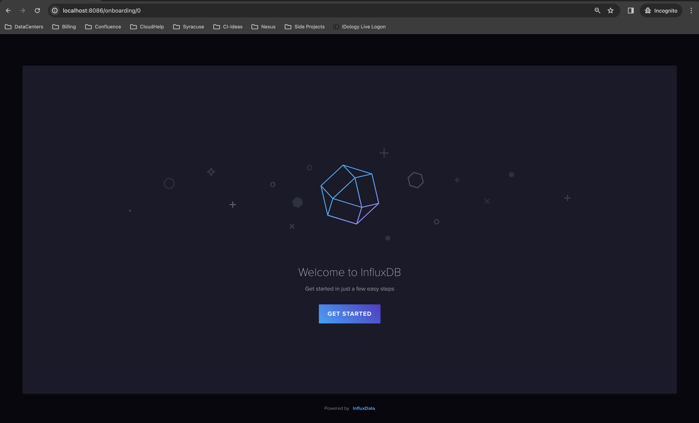
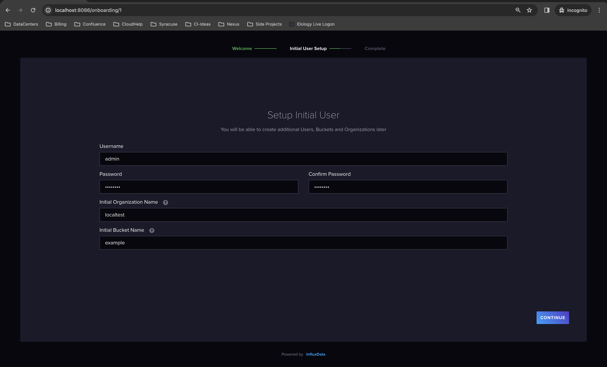
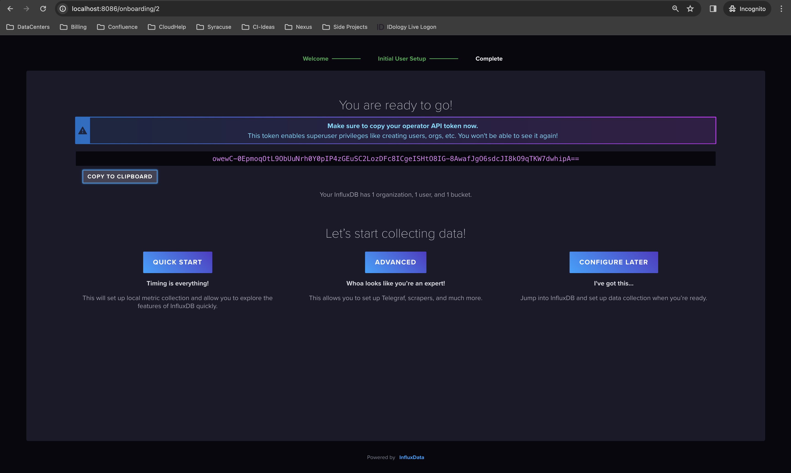
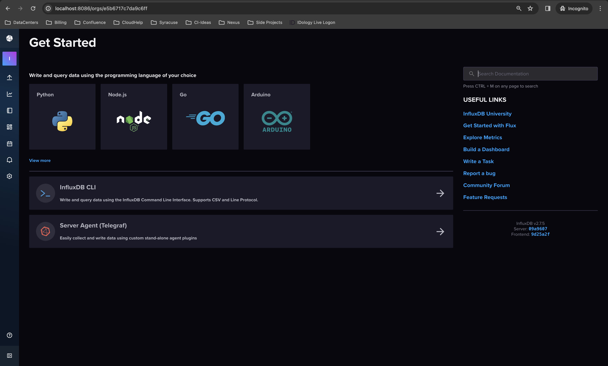
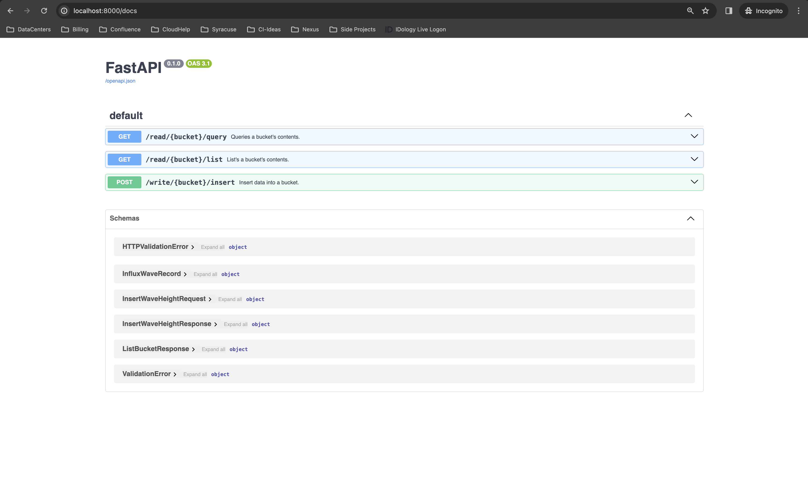
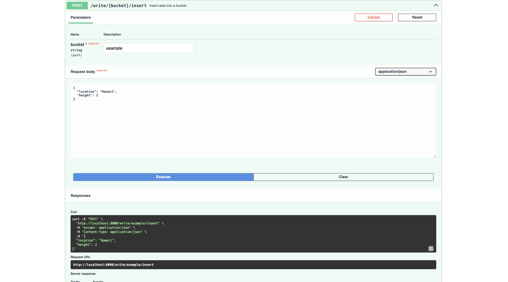
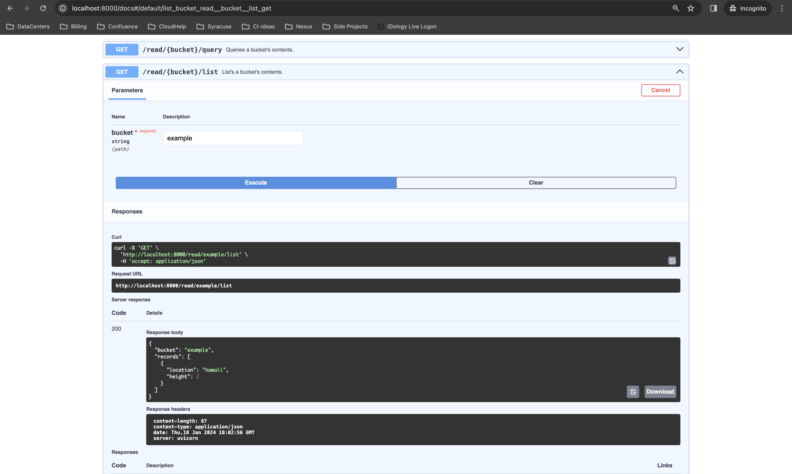

# Recording Time Series Data With APIs: InfluxDB + FastAPI
## Building an API that can read, query, and write data into FastAPI


## Introduction
Time series data has seen an explosion over the past few years, and for good
reason. It can be used everywhere. Look at Datadog, for example. Datadog
took time series data to the next level by building monitors, metrics, alerts,
etc. on top of that data. Tableau recently got into the time series data game
as well to provide better reporting capabilities to users. But, at its core, 
what is time series data?

## Time Series Data
Time series data is data that is recorded over consistent time intervals. It
can be used to see how certain data points change over time. For example, in our
project today, we will be monitoring heights of waves over some time period.
This wouldn't make too much sense in a typical relational database. What would
our tables look like? One table for locations, one for wave heights, and a relational
table to tie them together? How often do we insert rows into the wave heights table?
I think its clear to see we would have a large mess of sloppy data which would
make queries slow, complex, and hard to understand. This is where time series
data thrives! Now, time series data is structured and queried differently, so
something like postgres wouldn't be a natural fit. We can't just shoehorn time 
series data into a relational database engine. Enter [InfluxDB](https://www.influxdata.com/) 
which has been specifically built to handle time series data. Now, there are other time
series database engines (like TimeScale and CrateDB), but I like Influx...
so that's what we will use today!

## Project Overview And Setup
So, what are we building today? Well, we want to build an API that can read, write, 
and query data from InfluxDB. The database should allow users to:

1. Record a new wave height in some location
2. List all of the known waves and their locations
3. Filter the records based on location
4. Filter the records based on minimum wave height
5. Filter the records based on a combination of 3 and 4

We then want the API to serialize this data in a nice and predefined format and 
return it to some caller. We could imagine that the caller would be some charting
frontend that tells surfers where big swells have been over the course of the past
day or week or month.

For our API, we will be using Python and FastAPI. We will add two routers: one 
to read data and one to write data. We will then implement an InfluxDB client
which somewhat restricts the overall power of the 
[influx-python-client](https://github.com/influxdata/influxdb-client-python/tree/master)
library.

The directory structure can be seen below:

```shell
.
├── __init__.py
├── client
│   ├── __init__.py
│   └── influx.py
├── config.py
├── main.py
├── routes
│   ├── __init__.py
│   ├── read.py
│   └── write.py
└── schemas.py
```

We see that we have a `client` directory, which is where we will
write our restricted client library. We also have a `routes`
directory whcih will house our read/write API routers. And then
we have a few files: `config.py`, `main.py`, and `schemas.py`.
`config.py` is where we will place our InfluxDB connection  settings.
`main.py` is where we will actually start/run our API and glue
everything together. And finally, `schemas.py` is where we will put
our pydantic models that our API and client will use.

There are a few external libraries to install, such as `influx-python-client`
and `fastapi`. I have provided a [requirements.txt](https://github.com/afoley587/52-weeks-of-projects-2024/blob/main/04-influx-db-fastapi/requirements.txt) for ease of use!

With all this being said, I will make two assumptions:

1. You have [python](https://www.python.org/) installed
2. You have [docker-compose](https://docs.docker.com/compose/) installed

## Building The API
Now that we know what we are building, let's begin building it. I have
broken down the process into 5 steps:

1. Writing Our Pydantic Models
2. Writing Our Client
3. Writing Our Write Router
4. Writing Our Read Router
5. Configuration And Tying It Together

So, let's begin!

### Step 1: Writing Our Pydantic Models
Schemas are what our APIs and Client will use to fetch data
and put them into some normalized, jsonifiable format. Typically, 
we would have two different sets of files: `schemas.py` and `models.py`.
Schemas would typically be used for REST API responses/requests while
models might be used closer to the data layer and deal with the database
result sets. However, in our case, we will just combine the two for 
brevity and because the size of our API is so small.

First, we have our `InfluxWaveRecord` model. This model is our only real
database model. When the client fetches data from InfluxDB, it will put
each record into a `InfluxWaveRecord` type and then return a list of those
to the caller. More on that later! The `InfluxWaveRecord` model has two
attributes: a location of the wave and the height of the wave.

Next, we have a request/response pair for when we want to insert data
into InfluxDB. These seem like duplicates, but I like to keep request
and response models separate so that updating one (i.e. providing
more information in a response) is easy and makes our code more flexible.

The `InsertWaveHeightRequest` will be used when a user sends data to
our API. It has two attributes: a location of the wave and the height 
of the wave. The `InsertWaveHeightResponse` is what will be returned
to the user after they insert data into InfluxDB. It has the same
two attributes as `InsertWaveHeightRequest`.

Finally, we have a response for when a user tries to read/list/query
InfluxDB. The `ListBucketResponse` has two attributes: the bucket
that was queried and a list of all of the `InfluxWaveRecord`
that were returned (either a listing of the entire bucket
or a filtered/queried subset).

```python
class InfluxWaveRecord(BaseModel):
    location: str = Field(description="Location of the recorded wave")
    height: float = Field(description="Height of the recorded wave")


class InsertWaveHeightRequest(BaseModel):
    location: str = Field(description="Location of the recorded wave")
    height: float = Field(description="Height of the recorded wave")


class InsertWaveHeightResponse(BaseModel):
    bucket: str = Field(description="Name of the requested bucket")
    location: str = Field(description="Location of the recorded wave")
    height: float = Field(description="Height of the recorded wave")


class ListBucketResponse(BaseModel):
    bucket: str = Field(description="Name of the requested bucket")
    records: List[InfluxWaveRecord] = Field(
        description="Contents of the requested bucket"
    )
```

### Step 2: Writing Our Client
Now, we need to implement a way to interact with our Influx database.
We also want to handle some exceptions so that our API doesn't return
error 500 codes on unhandled exceptions. We have two expections that we
expect to handle. The first being the `InfluxNotAvailableException` which
is what will be raised when InfluxDB can't be reached. Next, we have the
`BucketNotFoundException` which is what will be raised if a user requests
a bucket doesn't exist.

```python
class InfluxNotAvailableException(Exception):
    STATUS_CODE = 503
    DESCRIPTION = "Unable to connect to influx."


class BucketNotFoundException(Exception):
    STATUS_CODE = 404
    DESCRIPTION = "Bucket Not Found."


class BadQueryException(Exception):
    STATUS_CODE = 400
    DESCRIPTION = "Bad Query."
```

With our exceptions out of the way, we can build our InfluxDB interface.
The `InfluxWaveClient` will be initialized with a bucket, a token, an
organization, and a url. The bucket will be used when reading/inserting
data into InfluxDB. The URL, token, and organization will be used to connect
to the right InfluxDB instance. The client provides a few "public" methods
to users: `record_wave_height`, `read_wave_height`, and `list_wave_heights`.
It also has two "private" methods: `_insert` and `_query`.

First, we will discuss our "public" methods. `record_wave_height` takes a
few parameters from the caller: a location to record and the wave's height
to record. It create a Point object and then calls the "private" `_insert`
method with that point. Next, we have the `read_wave_height` method. This
method also takes two parameters: a location to filter for and a minimmum 
height to filter on. For example, if we pass "hawaii" and "1.25", we would
be looking for waves in Hawaii that are at least 1.25 (unit doesn't matter).
This would call the "private" `_query` method with the relevant filters
and return the matching data points to the caller. The `list_wave_heights`
method does almost the same thing. It just calls the `read_wave_height` 
method with the default/empty parameters which would match all data points
in the database.


```python
class InfluxWaveClient:
    """A restricted client which implements an interface
    to query the wave-related data from the Influx database
    """

    MEASUREMENT_NAME: str = "surf_heights"

    def __init__(self, bucket: str, token: SecretStr, org: str, url: str) -> None:
        self.bucket = bucket
        self._client = InfluxDBClient(url=url, token=token.get_secret_value(), org=org)

    async def record_wave_height(self, location: str, height: float) -> None:
        """Records a new wave height for a given location

        Arguments:
            location (str): The location to tag the data point as
            height (float): The height of the measured wave

        Returns:
            None
        """
        location = location.lower()
        p = (
            Point(InfluxWaveClient.MEASUREMENT_NAME)
            .tag("location", location)
            .field("height", height)
        )
        await self._insert(p)

    async def read_wave_height(
        self, location: str = "", min_height: float = -1.0
    ) -> List[InfluxWaveRecord]:
        """Reads a wave height given a specific

        Arguments:
            location (str): The location to filter on
            min_height (float): The minimum wave height to filter on

        Returns:
            res (List[InfluxWaveRecord]): The datapoints that match this filter
        """
        query = f'from(bucket:"{self.bucket}")\
            |> range(start: -10m) \
            |> filter(fn:(r) => r._measurement == "{InfluxWaveClient.MEASUREMENT_NAME}")'
        if location:
            location = location.lower()
            query += f'|> filter(fn:(r) => r.location == "{location}")'
        if min_height > 0:
            query += f'|> filter(fn:(r) => r._field >= "{min_height}")'
        return await self._query(query)

    async def list_wave_heights(self) -> List[InfluxWaveRecord]:
        """Lists the bucket in question

        Arguments:
            None

        Returns:
            res (List[InfluxWaveRecord]): All waves in the buckets
        """
        return await self.read_wave_height(location="", min_height=-1.0)
```

The "private" methods are `_insert` and `_query`. `_insert` will take a 
data point from the caller. It will use InfluxDB's `write_api` to store
the data point in the database. The `_query` method uses InfluxDB's
`query_api` to send the given query to the database. It then puts all
of the records returned from the `query_api` into the pydantic model 
we discussed above in step 1.

```python
    async def _insert(self, p: Point) -> Any:
        """Inserts a point into the database via InfluxDB write_api

        Arguments:
            p (Point): The data point to insert into the database

        Returns:
            res (Any): Results from the write_api
        """
        write_api = self._client.write_api(write_options=SYNCHRONOUS)
        try:
            res = write_api.write(bucket=self.bucket, record=p)
        except NewConnectionError:
            raise InfluxNotAvailableException()
        except ApiException as e:
            if e.status and e.status == 400:
                raise BadQueryException()
            if e.status and e.status == 404:
                raise BucketNotFoundException()
            raise InfluxNotAvailableException()
        logger.info(f"{res=}")
        return res

    async def _query(self, query: str = "") -> List[InfluxWaveRecord]:
        """Queries the InfluxDB with the provided query string

        Arguments:
            query (str): The raw query string to pass to InfluxSB

        Returns:
            res (List[InfluxWaveRecord]): A list of waves that match the query
        """
        logger.debug(f"Running {query=}")
        query_api = self._client.query_api()
        try:
            result = query_api.query(query=query)
        except NewConnectionError:
            raise InfluxNotAvailableException()
        except ApiException as e:
            if e.status and e.status == 400:
                raise BadQueryException()
            if e.status and e.status == 404:
                raise BucketNotFoundException()
            raise InfluxNotAvailableException()
        res = []
        for table in result:
            for record in table.records:
                r = InfluxWaveRecord(
                    location=record.values.get("location"), height=record.get_value()
                )
                res.append(r)
        logger.debug(f"Query returned {len(res)} records")
        return res
```

### Step 3: Writing Our Write Router
With the schemas and client out of the way, we can begin to use them
within our routers. Let's start with the write router. This router
will include the following endpoint: `/write/<bucket>/insert`.

The insert endpoint will take a `InsertWaveHeightRequest` request
from the caller. It will instantiate the client and pass the
location and height from the client request to the `record_wave_height`
method. Then, it will just return the stored data to the user.

```python
write_router = APIRouter(prefix="/write")


@write_router.post(
    "/{bucket}/insert",
    summary="Insert data into a bucket.",
    responses={
        201: {"description": "Successfully Inserted Into Bucket."},
        400: {"description": "Bad data requested."},
        404: {"description": "Bucket not found."},
        503: {"description": "InfluxDB Not Available"},
    },
)
async def insert_bucket(
    r: InsertWaveHeightRequest, bucket: str
) -> InsertWaveHeightResponse:
    logger.debug(f"Insert data into {bucket=}")
    ic = InfluxWaveClient(
        bucket, settings.influx_token, settings.influx_org, settings.influx_url
    )
    try:
        await ic.record_wave_height(r.location, r.height)
    except (
        InfluxNotAvailableException,
        BucketNotFoundException,
        BadQueryException,
    ) as e:
        raise HTTPException(
            status_code=e.STATUS_CODE,
            detail=e.DESCRIPTION,
        )
    logger.debug(f"Inserted data into {bucket=} with {r.location=} and {r.height=}")
    return InsertWaveHeightResponse(bucket=bucket, location=r.location, height=r.height)
```

### Step 4: Writing Our Read Router
Let's move on to the read router. This router
will include the following endpoints: `/read/<bucket>/query` and
`/read/<bucket>/list`. 

The query endpoint will take two optional query parameters from the 
caller: location and min_height. It will then instantiate our client
using the server's settings (discussed later). It then calls the 
`read_wave_height` client method and then return all of the matching
data points to the caller.

```python
read_router = APIRouter(prefix="/read")


@read_router.get(
    "/{bucket}/query",
    summary="Queries a bucket's contents.",
    responses={
        200: {"description": "Successfully Queried Bucket."},
        400: {"description": "Bad Filter Requested."},
        404: {"description": "Bucket not found."},
        503: {"description": "InfluxDB Not Available"},
    },
)
async def query_bucket(
    r: Request, bucket: str, location: str = "", min_height: float = -1.0
) -> ListBucketResponse:
    logger.debug(f"Querying {bucket=} with {location=} and {min_height}")
    ic = InfluxWaveClient(
        bucket, settings.influx_token, settings.influx_org, settings.influx_url
    )
    try:
        records = await ic.read_wave_height(location=location, min_height=min_height)
    except (
        InfluxNotAvailableException,
        BucketNotFoundException,
        BadQueryException,
    ) as e:
        raise HTTPException(
            status_code=e.STATUS_CODE,
            detail=e.DESCRIPTION,
        )
    logger.debug(f"Records fetched {records=}")
    return ListBucketResponse(bucket=bucket, records=records)
```

The list endpoint does almost the same thing except, it doesn't have
any query parameters because we really just want all of the data points
from the bucket. So, this method instantiates the client and then calls
the `list_wave_heights` method and returns the data points to the caller.

```python
@read_router.get(
    "/{bucket}/list",
    summary="List's a bucket's contents.",
    responses={
        200: {"description": "Successfully Listed Bucket."},
        404: {"description": "Bucket not found."},
        503: {"description": "InfluxDB Not Available"},
    },
)
async def list_bucket(r: Request, bucket: str) -> ListBucketResponse:
    logger.debug(f"Listing {bucket=}")
    ic = InfluxWaveClient(
        bucket, settings.influx_token, settings.influx_org, settings.influx_url
    )
    try:
        records = await ic.list_wave_heights()
    except (
        InfluxNotAvailableException,
        BucketNotFoundException,
        BadQueryException,
    ) as e:
        raise HTTPException(
            status_code=e.STATUS_CODE,
            detail=e.DESCRIPTION,
        )
    return ListBucketResponse(bucket=bucket, records=records)
```

### Step 5: Configuration And Tying It Together
All of the pieces of the puzzle are now built! We can then create a 
reusable set of settings that our clients can use. For this, we will
use pydantic's `BaseSettings` class. We will have three settings:

1. influx_url - The InfluxDB connection URL
2. influx_token - The InfluxDB authentication token
3. influx_org - The InfluxDB organization

```python
class Settings(BaseSettings):
    influx_url: str = os.environ.get("INFLUX_URL")
    influx_token: SecretStr = os.environ.get("INFLUX_TOKEN")
    influx_org: str = os.environ.get("INFLUX_ORG")


settings = Settings()
```

These should look familiar from our routers!

Finally, we can attach our routers to our FastAPI App and use uvicorn to kick 
it off.

```python
app = FastAPI()
app.include_router(read_router)
app.include_router(write_router)
```

## Running The Stack
Let's start running everything. We won't go into too much depth on
the configuration of InfluxDB. What we will do is run InfluxDB via
docker-compose, then we will walk through the UI to do a very basic
bootstrap and root user creation. We will then run our API and interact
with it via the Swagger docs.

### Step 1: Bootstrapping InfluxDB
Let's start by spinning up our InfluxDB instance. I have provided a 
docker-compose file [here](https://github.com/afoley587/52-weeks-of-projects-2024/blob/main/04-influx-db-fastapi/docker-compose.yml). Go clone the [git repo](https://github.com/afoley587/52-weeks-of-projects-2024/tree/main/04-influx-db-fastapi) and run the following:

```
prompt> docker-compose up -d                           
[+] Running 3/3
 ✔ Network 04-influx-db-fastapi_default             Created        0.0s 
 ✔ Volume "04-influx-db-fastapi_influxdb2"          Created        0.0s 
 ✔ Container 04-influx-db-fastapi-influxdb-1        Started        0.0s 
```

Let's now open a browser and navigate to http://localhost:8086. You should
see the onboarding page (shown below):



We will click the `GET STARTED` button and enter a username, password, 
intiial organization, and initial bucket:



Let's copy the admin token to our clipboard and then select `CONFIGURE LATER`:



And we should now be ready to interact with InfluxDB:




### Step 2: Using Our API
InfluxDB is now up and running! Let's set our environment variables:

```shell
#### NOTE: Your token will be different than mine - and this token
#### is not sensitive to me
prompt> export INFLUX_URL=http://localhost:8086
prompt> export INFLUX_TOKEN="owewC-0EpmoqOtL9ObUuNrh0Y0pIP4zGEuSC2LozDFc8ICgeISHtO8IG-8AwafJgO6sdcJI8kO9qTKW7dwhipA=="
prompt> export INFLUX_ORG=localtest
```

Now we should be able to spin up our API:

```shell
prompt> poetry run uvicorn influxapi.main:app --reload                                                                
INFO:     Will watch for changes in these directories: ['/Users/alexanderfoley/mycode/52-weeks-of-projects/04-influx-db-fastapi']
INFO:     Uvicorn running on http://127.0.0.1:8000 (Press CTRL+C to quit)
INFO:     Started reloader process [45809] using StatReload
INFO:     Started server process [46035]
INFO:     Waiting for application startup.
INFO:     Application startup complete.
```

Once our API starts, we can go back to a browser and head to 
http://localhost:8000/docs which will open up our Swagger docs:



Let's expand the `/write/{bucket}/insert` tab and send a few data points
to the API (and therefore Influx):



And finally, let's list our data from the bucket:



Play around with querying the data too!

Thanks for reading along, please feel free to grab this code from [github](https://github.com/afoley587/52-weeks-of-projects-2024/tree/main/04-influx-db-fastapi)!