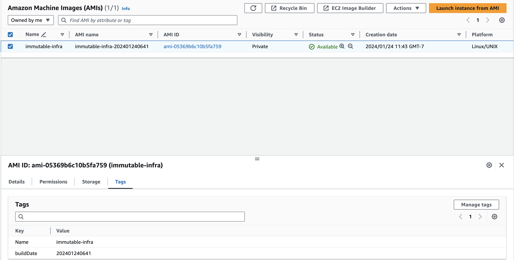
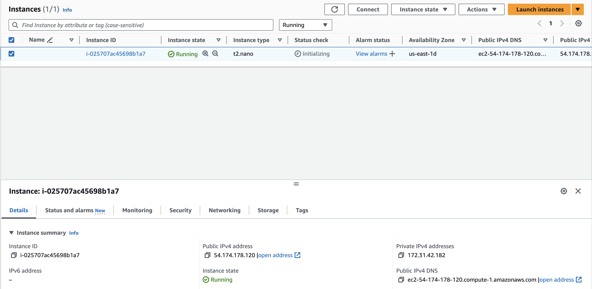
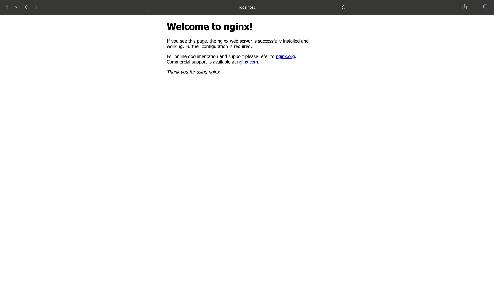

# Building and Deploying Immutable Infrastructure On AWS
## A tale of two tools: Terraform and Packer

In the world of infrastructure, two main types have reigned king: 
mutable and immutable. We can think of mutable infrastructure as a piece
of infrastructure that we apply upgrades to without destroying. For example, 
let's say you have Nginx running on an EC2 instance. In the mutable world, 
you would use a configuration management tool, such as ansible, to perform
the following steps:

1. Stopping the service
2. Upgrading the binaries with a package manager (think `apt-get` or `dnf`)
3. Making any configuration changes
4. Restarting the service

In the immutable world, on the other hand, you would build a new image with
some image builder tool like packer. Packer would do steps 1-4 above, but it 
would do it on a base AMI which you would then deploy with terraform. Terraform
would likely create the new instance, swap your load balancer or DNS names to 
the new instance, and then remove the old instance.

One side leans on the side convenience (mutable) where the other side leans on
the side of ephemerality and statelessness. Now, where have I __really__ seen this
come in handy? In the case of big system upgrades. Have you ever tried to upgrade
an old version of debian, say from 10 to 11? Well, no, it's not the end of the world.
But, you do have to:

* backup the server
* update the packages
* update the sources.list
* do a full upgrade
* verify the upgrade

Wouldn't it be easier if you could just build a new image, deploy that, and be done
with it? Well, we're going to go over immutable infrastructure today. We will build
a base image with packer and ansible and then we will deploy it with terraform.

I also want to go on the record for saying that mutable infrastructure does have
its place in a lot of places! My blog is not to say __**DON'T USE MUTABLE INFRA**__.
I just simply want to explain immutable and show you what it is... hopefully you 
find it useful!

## Prerequisites
We will be using three tools to deploy a piece of immutable infrastructure:

* [packer](https://www.packer.io/)
* [ansible](https://www.ansible.com/)
* [terraform](https://www.terraform.io/)
* [AWS CLI](https://aws.amazon.com/cli/)

I will also be deploying an EC2 instance into AWS. If you want to follow along,
and I hope you do, please make sure you have these four tools installed and an 
AWS account setup.

## Directory Structure / Project Setup
The directory layout is below. I have tried to label all directories according
to the tools that they pertain to:

```shell
.
├── README.md
├── ansible
│   ├── main.yml
│   └── tasks
│       ├── nginx.yml
│       └── ufw.yml
├── packer
│   ├── nginx-server.pkr.hcl
│   ├── plugins.pkr.hcl
│   └── variables.pkr.hcl
└── terraform
    ├── ec2.tf
    ├── iam.tf
    ├── outputs.tf
    └── versions.tf

5 directories, 10 files
```

So, the `packer` directory is all of the `packer` HCL which will define our 
image build. The `anisble` directory will define our playbooks which will
configure that image. And the `terraform` directory will be used to hold
our `terraform` HCL to deploy the image.

# Building The Image

## Packer: Defining The Build
First, we will be building the base image. As previously noted, we will be 
using terraform and ansible to accomplish this task. Packer will be used
to clone an existing AMI and more-or-less make it our own by adding tags to
it, configuring initial ssh connections to it, giving the AMI a name, etc.
Packer will then call ansible to do more of the nitty-gritty configuration
such as installing packages, configuring os-level firewall rules, etc.

Our packer directory has three files:

1. `plugins.pkr.hcl` - Defines the plugins our packer project will use. For
    example, an aws and ansbile plugin.
2. `variables.pkr.hcl` - Defines the variables that we will be using in our
    packer build. For example, ssh usernames and ami names.
3. `nginx-server.pkr.hcl` - Defines the bulk of the build. For example,
    finding the base AMI on AWS, definining our new AMI, and calling
    ansible.

Our `plugins.pkr.hcl` just tells packer which plugins to install
locally, which versions to use, etc. We can think of this similar
to a python TOML file:

```hcl
packer {
  required_plugins {
    amazon = {
      version = ">= 1.2.8"
      source  = "github.com/hashicorp/amazon"
    }
    ansible = {
      version = "~> 1"
      source  = "github.com/hashicorp/ansible"
    }
  }
}
```

In the above, we are telling packer to install at least version 1.2.8
of the AWS plugin and any ansible version that is from major version 1.

Our `variables.pkr.hcl` file is another super simple file. It just tells
packer about variables that we define. We're only going to define three, 
but you could define just about as many as you'd like:

```hcl
variable "ami_name" {
  type    = string
  default = "immutable-infra"
}

variable "instance_type" {
  type    = string
  default = "t2.micro"
}

variable "ssh_username" {
  type    = string
  default = "admin"
}
```

As you can see, we have three variables:

1. `ami_name` which is a string that defaults to `immutable-infra`
2. `instance_type` which is a string that defaults to `t2.micro`
3. `ssh_username` which is a string that defaults to `admin`

The least simple file in the packer configuration is `nginx-server.pkr.hcl`.
Like I said before, it defines the bulk of the logic for this build. Let's 
take it step by step so that we understand what we're looking at.

```hcl
locals {
  build_date = formatdate("YYYYMMDDHHmm", timestamp())
}

data "amazon-ami" "debian" {
  filters = {
    name                = "debian-11-amd64*"
    root-device-type    = "ebs"
    virtualization-type = "hvm"
  }
  most_recent = true
  owners      = ["136693071363"]
}
```

At the top of our file are our `locals` and `data` sources. We can
think of `locals` as similar to variables, but they are less-easily
modified. Our `build_date` will be string representation of when the
build occured in `YYYYMMDDHHmm` format (``, for example). Naturally,
we don't want some user to define their own timestamp. Next, comes 
the `data` source. `data` sources are like read-only objects in both
packer and terraform. We're telling packer to go to aws, look for
an AMI with the name of `debian-11-amd64*`, device type of `ebs`, and
virtualization type of `hvm`. There might be multiple, so only return
to us the most recent one. We can then use this later, knowing the
exact image we selected.

```hcl
source "amazon-ebs" "debian" {
  ami_name              = "${var.ami_name}-${local.build_date}"
  instance_type         = "${var.instance_type}"
  communicator          = "ssh"
  encrypt_boot          = false
  force_delete_snapshot = true
  force_deregister      = true
  source_ami            = "${data.amazon-ami.debian.id}"
  ssh_username          = "${var.ssh_username}"

  tags = {
    Name      = "${var.ami_name}"
    buildDate = "${local.build_date}"
  }
}
```

Now, we have come to our `source` definition. We're starting
to actuall define and build our new AMI here. The `amazon-ebs`
source will go and make an EBS-Backed AMI image. We will be
giving it the name from our variables file appended with our
time stamp. We will also be using the `data` source we queried
for above. Finally, we will be adding a few tags on it. If we 
stopped here, we would have a copy of the base debian image with
the only customizations being a new name and extra tags.

```hcl
build {
  sources = ["source.amazon-ebs.debian"]

  provisioner "ansible" {
    ansible_env_vars = [
      "ANSIBLE_DIFF_ALWAYS=1",
      "ANSIBLE_FORCE_COLOR=1",
      "ANSIBLE_HOST_KEY_CHECKING=False"
    ]
    extra_arguments = [
      "--extra-vars",
      "ansible_python_interpreter=/usr/bin/python3",
      "--scp-extra-args",
      "'-O'"
    ]
    playbook_file = "../ansible/main.yml"
    user          = "${var.ssh_username}"
  }
}
```

Lastly, we have our `build` block. We are saying to packer "Here are 
the build definitions (`sources`) from above. Please go build them
for me". We also have a `provisioner` of type `ansible`. This is telling
packer "Okay, after the original cloning/tagging of the base image is 
done, run this ansible playbook to do some extra configuration before
finalizing the AMI".

Now, before going and running our packer build, let's take a peek at 
the ansible that packer is calling.

## Ansible: Provisioning and Tweaking The Image
The `main.yml` playbook will be called by packer:

```yaml
# main.yml
- name: Nginx AMI Build
  hosts: all
  become: true
  gather_facts: true

  pre_tasks:

    - name: upgrade all packages
      apt:
        update_cache: true
        upgrade: true

    - name: update all packages
      apt:
        name: "*"
        state: latest

  tasks:
    - name: Install and configure nginx
      include_tasks: ./tasks/nginx.yml

    - name: Install and configure ssm
      include_tasks: ./tasks/ssm.yml
    
    # As a security man, I do
    # highly recommended - https://github.com/dev-sec/ansible-collection-hardening
    - name: Install and configure ufw
      include_tasks: ./tasks/ufw.yml
```

Now, thankfully this is a pretty simple playbook. We will connect to the 
provisioned box, denoted by the `hosts: all` (hosts will be passed by packer).
We will become a privileged user, denoted by `become: true`. We will then
run an `apt upgrade` and then update all of the currently installed packages
to their latest version, denoted by the two `apt` modules under `pre_tasks`.

Now we finally get to some more specific tasks. We include the tasks in the 
`tasks/nginx.yml` file:

```yaml
# tasks/nginx.yml

- name: install nginx
  apt: 
    name: nginx 
    state: present
    install_recommends: false

- name: start nginx
  service:
    name: nginx
    state: started
    enabled: true
```

All we do with these tasks are:

1. installing the `nginx` binary
2. starting and enabling the service. Enabling is important because it
    means that the service will start even if the server is rebooted,
    which is exactly what we want.

After installing/configuring Nginx, we run another `include_tasks` on the
`tasks/ssm.yml` file:

```yaml
# tasks/nginx.yml

- name: Make temporary directory
  tempfile:
    state: directory
    suffix: ssm
  register: builddir

- name: Download SSM installer
  get_url:
    url: https://s3.amazonaws.com/ec2-downloads-windows/SSMAgent/latest/debian_amd64/amazon-ssm-agent.deb
    dest: "{{ builddir.path }}/amazon-ssm-agent.deb"
  
- name: Install SSM
  apt:
    deb: "{{ builddir.path }}/amazon-ssm-agent.deb"

- name: Start / enable SSM service
  service:
    name: amazon-ssm-agent
    state: started
    enabled: true
```

We are following the SSM install steps outlined [here](https://docs.aws.amazon.com/systems-manager/latest/userguide/agent-install-deb.html)
by AWS. We just create a temporary directory, download the installer into that
directory, install it, and start/enable to service.

After installing/configuring SSM, we run another `include_tasks` on the
`tasks/ufw.yml` file:

```yaml
# tasks/ufw.yml

- name: Install UFW
  apt:
    name: ufw
    state: present
    install_recommends: false

- name: allow ports through ufw
  ufw:
    rule: allow
    port: "{{ item.port }}"
    proto: "{{ item.proto }}"
  loop:
    - port: "22"
      proto: "tcp"
    - port: "80"
      proto: "tcp"
    - port: "443"
      proto: "tcp"

- name: Reload Firewall
  ufw:
    state: "reloaded"

- name: enable ufw
  ufw:
    state: "enabled"
```

Personally, I like UFW. It stands for the Uncomplicated FireWall.
I just find it easier than IPTables. In this task list, we:

1. Make sure UFW is installed
2. Make firewall rules on the OS to allow traffic to ports 22, 80, and 443
3. Reload the firewall so the changes take effect
4. Enable the service so it starts automatically when the server boots up

## Running The Build
We are done telling packer and ansible how we want our machine to look.
Now we can go ahead and actually build the AMI. Let's navigate to the
packer directory and build the image:

```shell
# Set your AWS Environment variables so packer can authenticate
# to AWS
prompt> export AWS_ACCESS_KEY_ID="<AWS_ACCESS_KEY_ID>"
prompt> export AWS_SECRET_ACCESS_KEY="<AWS_SECRET_ACCESS_KEY>"
prompt> export AWS_REGION="<AWS_REGION>"
prompt> export AWS_DEFAULT_REGION="<AWS_REGION>"
prompt> packer build .
amazon-ebs.debian: output will be in this color.

==> amazon-ebs.debian: Force Deregister flag found, skipping prevalidating AMI Name
    amazon-ebs.debian: Found Image ID: ami-0d44e049cfbdfa91f
==> amazon-ebs.debian: Creating temporary keypair: packer_65b164e3-bf8c-67f2-864d-ba5e132b83fd
==> amazon-ebs.debian: Creating temporary security group for this instance: packer_65b164e5-8461-ae47-1fe3-fad085a8dfce
==> amazon-ebs.debian: Authorizing access to port 22 from [0.0.0.0/0] in the temporary security groups...
==> amazon-ebs.debian: Launching a source AWS instance...
    amazon-ebs.debian: Instance ID: i-0f14c53d666b40167
==> amazon-ebs.debian: Waiting for instance (i-0f14c53d666b40167) to become ready...
==> amazon-ebs.debian: Using SSH communicator to connect: 44.211.197.248
==> amazon-ebs.debian: Waiting for SSH to become available...
==> amazon-ebs.debian: Connected to SSH!
==> amazon-ebs.debian: Provisioning with Ansible...
    amazon-ebs.debian: Setting up proxy adapter for Ansible....
==> amazon-ebs.debian: Executing Ansible: ansible-playbook -e packer_build_name="debian" -e packer_builder_type=amazon-ebs --ssh-extra-args '-o IdentitiesOnly=yes' --extra-vars ansible_python_interpreter=/usr/bin/python3 --scp-extra-args '-O' -e ansible_ssh_private_key_file=/var/folders/v7/xq3n2szs1511qnt_8t2q9qdm0000gp/T/ansible-key3171340456 -i /var/folders/v7/xq3n2szs1511qnt_8t2q9qdm0000gp/T/packer-provisioner-ansible3448790335 /Users/alexanderfoley/mycode/52-weeks-of-projects/05-building-immutable-infrastructure/ansible/main.yml
    amazon-ebs.debian:
    amazon-ebs.debian: PLAY [Nginx AMI Build] *********************************************************
    amazon-ebs.debian:
    amazon-ebs.debian: TASK [Gathering Facts] *********************************************************
    amazon-ebs.debian: ok: [default]
    amazon-ebs.debian:
    amazon-ebs.debian: TASK [upgrade all packages] ****************************************************
    amazon-ebs.debian: ok: [default]
    amazon-ebs.debian:
    amazon-ebs.debian: TASK [update all packages] *****************************************************
    amazon-ebs.debian: ok: [default]
    amazon-ebs.debian:
    amazon-ebs.debian: TASK [Install and configure nginx] *********************************************
    amazon-ebs.debian: included: /Users/alexanderfoley/mycode/52-weeks-of-projects/05-building-immutable-infrastructure/ansible/tasks/nginx.yml for default
    amazon-ebs.debian:
    amazon-ebs.debian: TASK [install nginx] ***********************************************************
    amazon-ebs.debian: The following additional packages will be installed:
    amazon-ebs.debian:   fontconfig-config fonts-dejavu-core libdeflate0 libfontconfig1 libgd3
    amazon-ebs.debian:   libgeoip1 libjbig0 libjpeg62-turbo libnginx-mod-http-geoip
    amazon-ebs.debian:   libnginx-mod-http-image-filter libnginx-mod-http-xslt-filter
    amazon-ebs.debian:   libnginx-mod-mail libnginx-mod-stream libnginx-mod-stream-geoip libtiff5
    amazon-ebs.debian:   libwebp6 libxslt1.1 nginx-common nginx-core
    amazon-ebs.debian: Suggested packages:
    amazon-ebs.debian:   libgd-tools geoip-bin fcgiwrap nginx-doc ssl-cert
    amazon-ebs.debian: Recommended packages:
    amazon-ebs.debian:   geoip-database
    amazon-ebs.debian: The following NEW packages will be installed:
    amazon-ebs.debian:   fontconfig-config fonts-dejavu-core libdeflate0 libfontconfig1 libgd3
    amazon-ebs.debian:   libgeoip1 libjbig0 libjpeg62-turbo libnginx-mod-http-geoip
    amazon-ebs.debian:   libnginx-mod-http-image-filter libnginx-mod-http-xslt-filter
    amazon-ebs.debian:   libnginx-mod-mail libnginx-mod-stream libnginx-mod-stream-geoip libtiff5
    amazon-ebs.debian:   libwebp6 libxslt1.1 nginx nginx-common nginx-core
    amazon-ebs.debian: 0 upgraded, 20 newly installed, 0 to remove and 0 not upgraded.
    amazon-ebs.debian: changed: [default]
    amazon-ebs.debian:
    amazon-ebs.debian: TASK [start nginx] *************************************************************
    amazon-ebs.debian: ok: [default]
    amazon-ebs.debian:
    amazon-ebs.debian: TASK [Install and configure ssm] ***********************************************
    amazon-ebs.debian: included: /Users/alexanderfoley/mycode/52-weeks-of-projects/05-building-immutable-infrastructure/ansible/tasks/ssm.yml for default
    amazon-ebs.debian:
    amazon-ebs.debian: TASK [Make temporary directory] ************************************************
    amazon-ebs.debian: changed: [default]
    amazon-ebs.debian:
    amazon-ebs.debian: TASK [Download SSM installer] **************************************************
    amazon-ebs.debian: changed: [default]
    amazon-ebs.debian:
    amazon-ebs.debian: TASK [Install SSM] *************************************************************
    amazon-ebs.debian: Selecting previously unselected package amazon-ssm-agent.
    amazon-ebs.debian: (Reading database ... 28597 files and directories currently installed.)
    amazon-ebs.debian: Preparing to unpack .../amazon-ssm-agent.deb ...
    amazon-ebs.debian: Preparing for install
    amazon-ebs.debian: -> Systemd detected
    amazon-ebs.debian: inactive
    amazon-ebs.debian: Unpacking amazon-ssm-agent (3.2.2086.0-1) ...
    amazon-ebs.debian: Setting up amazon-ssm-agent (3.2.2086.0-1) ...
    amazon-ebs.debian: Starting agent
    amazon-ebs.debian: changed: [default]
    amazon-ebs.debian:
    amazon-ebs.debian: TASK [Start / enable SSM service] **********************************************
    amazon-ebs.debian: ok: [default]
    amazon-ebs.debian:
    amazon-ebs.debian: TASK [Install and configure ufw] ***********************************************
    amazon-ebs.debian: included: /Users/alexanderfoley/mycode/52-weeks-of-projects/05-building-immutable-infrastructure/ansible/tasks/ufw.yml for default
    amazon-ebs.debian:
    amazon-ebs.debian: TASK [Install UFW] *************************************************************
    amazon-ebs.debian: The following NEW packages will be installed:
    amazon-ebs.debian:   ufw
    amazon-ebs.debian: 0 upgraded, 1 newly installed, 0 to remove and 0 not upgraded.
    amazon-ebs.debian: changed: [default]
    amazon-ebs.debian:
    amazon-ebs.debian: TASK [allow ports through ufw] *************************************************
    amazon-ebs.debian: changed: [default] => (item={'port': '22', 'proto': 'tcp'})
    amazon-ebs.debian: changed: [default] => (item={'port': '80', 'proto': 'tcp'})
    amazon-ebs.debian: changed: [default] => (item={'port': '443', 'proto': 'tcp'})
    amazon-ebs.debian:
    amazon-ebs.debian: TASK [Reload Firewall] *********************************************************
    amazon-ebs.debian: changed: [default]
    amazon-ebs.debian:
    amazon-ebs.debian: TASK [enable ufw] **************************************************************
    amazon-ebs.debian: changed: [default]
    amazon-ebs.debian:
    amazon-ebs.debian: PLAY RECAP *********************************************************************
    amazon-ebs.debian: default                    : ok=16   changed=8    unreachable=0    failed=0    skipped=0    rescued=0    ignored=0
    amazon-ebs.debian:
==> amazon-ebs.debian: Stopping the source instance...
    amazon-ebs.debian: Stopping instance
==> amazon-ebs.debian: Waiting for the instance to stop...
==> amazon-ebs.debian: Creating AMI immutable-infra-202401240728 from instance i-0f14c53d666b40167
    amazon-ebs.debian: AMI: ami-054ea51b0e0a3dbc5
==> amazon-ebs.debian: Waiting for AMI to become ready...
==> amazon-ebs.debian: Skipping Enable AMI deprecation...
==> amazon-ebs.debian: Adding tags to AMI (ami-054ea51b0e0a3dbc5)...
==> amazon-ebs.debian: Tagging snapshot: snap-0dddef6b6da91fa21
==> amazon-ebs.debian: Creating AMI tags
    amazon-ebs.debian: Adding tag: "Name": "immutable-infra"
    amazon-ebs.debian: Adding tag: "buildDate": "202401240728"
==> amazon-ebs.debian: Creating snapshot tags
==> amazon-ebs.debian: Terminating the source AWS instance...
==> amazon-ebs.debian: Cleaning up any extra volumes...
==> amazon-ebs.debian: No volumes to clean up, skipping
==> amazon-ebs.debian: Deleting temporary security group...
==> amazon-ebs.debian: Deleting temporary keypair...
Build 'amazon-ebs.debian' finished after 5 minutes 50 seconds.

==> Wait completed after 5 minutes 50 seconds

==> Builds finished. The artifacts of successful builds are:
--> amazon-ebs.debian: AMIs were created:
us-east-1: ami-054ea51b0e0a3dbc5
```

And voila - you have built your AMI. Your output might not be exactly the same
as mine, but you should be able to see some of the packer outputs and then some 
of the ansible output as well. This is how we know our ansible is being called
from packer! Let's go to the AWS console and check it out:



# Deploying The Image
Okay, we have the AMI built. Now let's deploy it.

We have four `.tf` files in our terraform directory:

1. `versions.tf` - The same idea as the `plugins.pkr.hcl` file we talked about
    in the packer section. We can skip discussing this one.
2. `iam.tf` - The IAM roles to attach to our Nginx EC2 instance. For example,
    we want to be able to use AWS SSM to connect to the instance. Because of
    that, we will have to add some permissions to the machine.
3. `ec2.tf` - The actual deployment of the EC2 instance.
4. `outputs.tf` - The outputs of the deployment

As noted, we will skip the `versions.tf` file. The idea is exactly the same
as the `plugins.pkr.hcl` we already discussed. The `iam.tf` file is new though.
In this file, we want to create an instance profile for the EC2 instance so it
can interact with AWS services and be granted specific roles. The one service
we're interested in is the SSM one. SSM let's us create secure sessions with
our machines without opening any security groups. This is great for private
demos such as this one because we don't have to worry about opening any 
`0.0.0.0/0` rules on SSH/HTTP(S) ports.

```hcl
# iam.tf
# Nginx For EC2
resource "aws_iam_instance_profile" "nginx_iam" {
  name = "nginxIam"
  role = aws_iam_role.nginx_iam.name
}

resource "aws_iam_role" "nginx_iam" {
  name               = "nginxIam"
  assume_role_policy = data.aws_iam_policy_document.nginx_iam.json
}

data "aws_iam_policy_document" "nginx_iam" {
  statement {
    effect = "Allow"

    principals {
      type = "Service"

      identifiers = [
        "ec2.amazonaws.com",
        "ssm.amazonaws.com",
      ]
    }

    actions = ["sts:AssumeRole"]
  }
}

resource "aws_iam_role_policy_attachment" "nginx_iam" {
  role       = aws_iam_role.nginx_iam.name
  policy_arn = "arn:aws:iam::aws:policy/AmazonSSMManagedInstanceCore"
}
```

We see that we create an instance profile and assign it our
creaetd role. That role is allowed to take the `AssumeRole`
action on the EC2 and SSM services. We also attach the `AmazonSSMManagedInstanceCore`
policy to our role.

Now that our IAM is out of the way, we can create our EC2 VM:

```hcl
# ec2.tf
data "aws_ami" "nginx" {
  most_recent = true

  filter {
    name   = "name"
    values = ["immutable-infra-*"]
  }

  filter {
    name   = "virtualization-type"
    values = ["hvm"]
  }

  owners = ["self"]
}

resource "tls_private_key" "nginx_ec2" {
  algorithm = "RSA"
  rsa_bits  = 4096
}

resource "aws_key_pair" "nginx_ec2" {
  key_name   = "nginx-ssh-key"
  public_key = tls_private_key.nginx_ec2.public_key_openssh
}


resource "aws_instance" "nginx_ec2" {
  ami                  = data.aws_ami.nginx.id
  instance_type        = "t2.nano"
  iam_instance_profile = aws_iam_instance_profile.nginx_iam.id
  key_name             = aws_key_pair.nginx_ec2.key_name
}
```

We are using a terraform `data` source to find and pull __our__
most recently built AWS AMI from AWS. This should look similar to
the packer file's `data` source, but we're using our names in the
filter instead of the default debian one. We then create an SSH
key pair for the instance. Finally, we deploy the instance using 
our AMI and key pair. Note creating the key pair in terraform will
have some security concerns because your TLS private keys are now 
stored in your terraform state. It might be more beneficial to pass 
the public key in as a variable in your production environment.

You also might be wondering:

"Why do I need SSH keys if we are using SSM?"

And that's a good question. We will be using both SSH and SSM technically. 
We will be using SSM to proxy our SSH traffic - meaning that we will need 
the SSH keys for linux authentication, but will be using SSM for AWS 
authentication (instead of relying on IP whitelisting).

Finally, we have an `outputs.tf` file:

```hcl
# outputs.tf
output "private_key" {
  value     = tls_private_key.nginx_ec2.private_key_pem
  sensitive = true
}

# terraform output -raw private_key > /tmp/nginx-ssh

```

All we are doing here is giving us a way to get the private SSH
key from terraform so that we can use it later.

We can now deploy our instance with terraform! Let's navigate to the
terraform directory and deploy it:

```shell
prompt> terraform apply  
data.aws_ami.nginx: Reading...
data.aws_iam_policy_document.nginx_iam: Reading...
data.aws_iam_policy_document.nginx_iam: Read complete after 0s [id=557597258]
data.aws_ami.nginx: Read complete after 0s [id=ami-05369b6c10b5fa759]

Terraform used the selected providers to generate the following execution plan. Resource actions are indicated with the following symbols:
  + create

Terraform will perform the following actions:

  # aws_iam_instance_profile.nginx_iam will be created
  + resource "aws_iam_instance_profile" "nginx_iam" {
      + arn         = (known after apply)
      + create_date = (known after apply)
      + id          = (known after apply)
      + name        = "nginxIam"
      + name_prefix = (known after apply)
      + path        = "/"
      + role        = "nginxIam"
      + tags_all    = (known after apply)
      + unique_id   = (known after apply)
    }

  # aws_iam_role.nginx_iam will be created
  + resource "aws_iam_role" "nginx_iam" {
      + arn                   = (known after apply)
      + assume_role_policy    = jsonencode(
            {
              + Statement = [
                  + {
                      + Action    = "sts:AssumeRole"
                      + Effect    = "Allow"
                      + Principal = {
                          + Service = [
                              + "ssm.amazonaws.com",
                              + "ec2.amazonaws.com",
                            ]
                        }
                    },
                ]
              + Version   = "2012-10-17"
            }
        )
      + create_date           = (known after apply)
      + force_detach_policies = false
      + id                    = (known after apply)
      + managed_policy_arns   = (known after apply)
      + max_session_duration  = 3600
      + name                  = "nginxIam"
      + name_prefix           = (known after apply)
      + path                  = "/"
      + tags_all              = (known after apply)
      + unique_id             = (known after apply)
    }

  # aws_iam_role_policy_attachment.nginx_iam will be created
  + resource "aws_iam_role_policy_attachment" "nginx_iam" {
      + id         = (known after apply)
      + policy_arn = "arn:aws:iam::aws:policy/AmazonSSMManagedInstanceCore"
      + role       = "nginxIam"
    }

  # aws_instance.nginx_ec2 will be created
  + resource "aws_instance" "nginx_ec2" {
      + ami                                  = "ami-05369b6c10b5fa759"
      + arn                                  = (known after apply)
      + associate_public_ip_address          = (known after apply)
      + availability_zone                    = (known after apply)
      + cpu_core_count                       = (known after apply)
      + cpu_threads_per_core                 = (known after apply)
      + disable_api_stop                     = (known after apply)
      + disable_api_termination              = (known after apply)
      + ebs_optimized                        = (known after apply)
      + get_password_data                    = false
      + host_id                              = (known after apply)
      + host_resource_group_arn              = (known after apply)
      + iam_instance_profile                 = (known after apply)
      + id                                   = (known after apply)
      + instance_initiated_shutdown_behavior = (known after apply)
      + instance_lifecycle                   = (known after apply)
      + instance_state                       = (known after apply)
      + instance_type                        = "t2.nano"
      + ipv6_address_count                   = (known after apply)
      + ipv6_addresses                       = (known after apply)
      + key_name                             = "nginx-ssh-key"
      + monitoring                           = (known after apply)
      + outpost_arn                          = (known after apply)
      + password_data                        = (known after apply)
      + placement_group                      = (known after apply)
      + placement_partition_number           = (known after apply)
      + primary_network_interface_id         = (known after apply)
      + private_dns                          = (known after apply)
      + private_ip                           = (known after apply)
      + public_dns                           = (known after apply)
      + public_ip                            = (known after apply)
      + secondary_private_ips                = (known after apply)
      + security_groups                      = (known after apply)
      + source_dest_check                    = true
      + spot_instance_request_id             = (known after apply)
      + subnet_id                            = (known after apply)
      + tags_all                             = (known after apply)
      + tenancy                              = (known after apply)
      + user_data                            = (known after apply)
      + user_data_base64                     = (known after apply)
      + user_data_replace_on_change          = false
      + vpc_security_group_ids               = (known after apply)
    }

  # aws_key_pair.nginx_ec2 will be created
  + resource "aws_key_pair" "nginx_ec2" {
      + arn             = (known after apply)
      + fingerprint     = (known after apply)
      + id              = (known after apply)
      + key_name        = "nginx-ssh-key"
      + key_name_prefix = (known after apply)
      + key_pair_id     = (known after apply)
      + key_type        = (known after apply)
      + public_key      = (known after apply)
      + tags_all        = (known after apply)
    }

  # tls_private_key.nginx_ec2 will be created
  + resource "tls_private_key" "nginx_ec2" {
      + algorithm                     = "RSA"
      + ecdsa_curve                   = "P224"
      + id                            = (known after apply)
      + private_key_openssh           = (sensitive value)
      + private_key_pem               = (sensitive value)
      + private_key_pem_pkcs8         = (sensitive value)
      + public_key_fingerprint_md5    = (known after apply)
      + public_key_fingerprint_sha256 = (known after apply)
      + public_key_openssh            = (known after apply)
      + public_key_pem                = (known after apply)
      + rsa_bits                      = 4096
    }

Plan: 6 to add, 0 to change, 0 to destroy.

Changes to Outputs:
  + private_key = (sensitive value)

Do you want to perform these actions?
  Terraform will perform the actions described above.
  Only 'yes' will be accepted to approve.

  Enter a value: yes

tls_private_key.nginx_ec2: Creating...
aws_iam_role.nginx_iam: Creating...
tls_private_key.nginx_ec2: Creation complete after 1s [id=819024842a6a3bedaef3b393f087c1ddb7ea6cb4]
aws_key_pair.nginx_ec2: Creating...
aws_iam_role.nginx_iam: Creation complete after 1s [id=nginxIam]
aws_iam_role_policy_attachment.nginx_iam: Creating...
aws_iam_instance_profile.nginx_iam: Creating...
aws_iam_role_policy_attachment.nginx_iam: Creation complete after 0s [id=nginxIam-20240124190454125800000001]
aws_key_pair.nginx_ec2: Creation complete after 0s [id=nginx-ssh-key]
aws_iam_instance_profile.nginx_iam: Creation complete after 1s [id=nginxIam]
aws_instance.nginx_ec2: Creating...
aws_instance.nginx_ec2: Still creating... [10s elapsed]
aws_instance.nginx_ec2: Still creating... [20s elapsed]
aws_instance.nginx_ec2: Still creating... [30s elapsed]
aws_instance.nginx_ec2: Creation complete after 38s [id=i-025707ac45698b1a7]

Apply complete! Resources: 6 added, 0 changed, 0 destroyed.

Outputs:

private_key = <sensitive>
```

We can see the deployed EC2 instance in the EC2 console:



# Connecting To Our Instance

Let's now connect to our instance. We will be using AWS SSM to
start a proxy session with our instance. You can get your AWS 
instance ID from the console above (or from your terraform output):

```shell
prompt> aws ssm start-session \
    --target i-025707ac45698b1a7 \
    --document-name AWS-StartPortForwardingSession \
    --parameters '{"portNumber":["80"], "localPortNumber":["8000"]}'
```

We can navigate to `localhost:8000` in a local browser and view
our Nginx webpage!



Thanks for following along! I hope you enjoyed it! If you want to
dive deeper into the code, it can all be found [here on github](https://github.com/afoley587/52-weeks-of-projects-2024/tree/main/05-building-immutable-infrastructure).