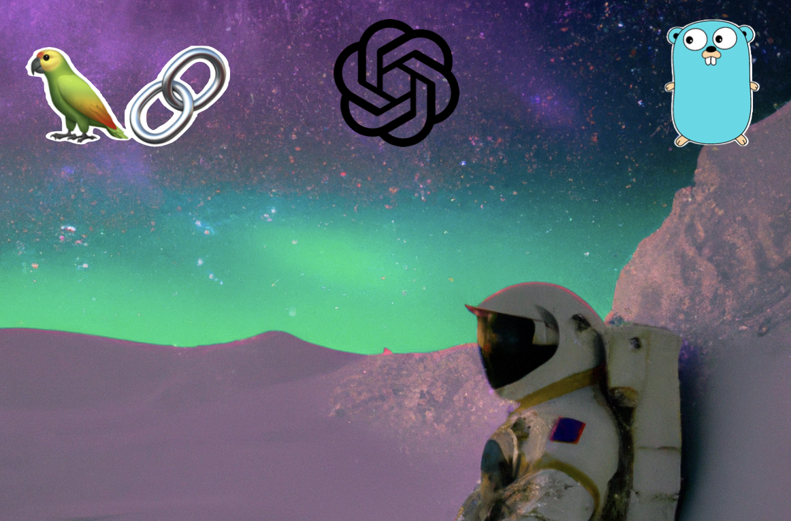

# Building an LMM API With GoLang
## Langchain + GinGonic + GoLang



Large language models, like ChatGPT, Llama, etc., have taken
the world by storm over the past 12 months. If you don't believe me,
let's take a look at how long it took ChatGPT to get to 1 million 
users as compared to some other behemoths. Graph is courtesy
of [exploding topics](https://explodingtopics.com/blog/chatgpt-users).


Looking at this, we can see it took chatGPT 5 days to get to 1 million users.
Netflix took almost 4 years to get there. Now, I know that times have changed
and the internet era has boomed which helps these companies grow. But still,
5 days, REALLY?!

LLMs in general have become applicable to almost every single industry from 
health care to finance. If you're in any industry that has been impacted by
LLMs, it's probably a good idea to learn one or two things about them. If
you're like me, who writes software for a living, it's a good idea to know
how to use it and what some of the stuff means.

As always, breaking in to a new field is so difficult because you have to cut through
the technical jargon, find the right place to start, and find a way
to learn the new tech so that you don't feel obsolete. I don't know how you
learn best, but I am a learn-by-doer. I like to combine something I know
really well with something I don't. By doing that, I see where the new
puzzle piece fits into my overall puzzle (my brain).

So, let's get started by introducing our stars of the show: GinGonic and Langchain.

## What Is GinGonic
[GinGonic](https://github.com/gin-gonic/gin) is a modern, fast, web framework for 
building APIs with GoLang. It is designed to be easy to use, efficient, and 
highly performant, leveraging the power of GoLang concurrency for extremely 
high throughput.


## What Is LangChain
[Langchain](https://www.langchain.com/), on the other hand, is a 
framework for developing applications powered by 
language models. It is designed to let you effortlessly plug in to an LLM and
enables users to provide extra context to the LLM. Simply put, LangChain enables LLM 
models to generate responses based on the most up-to-date information available online, 
in documents, or from other data sources.

## Setup and Prerequisites
If you're following along, I do expect you to have [GoLang](https://go.dev/)
installed. I also expect you to fetch the required
go dependencies:

1. [GinGonic](https://pkg.go.dev/github.com/gin-gonic/gin)
2. [LangchainGo](https://pkg.go.dev/github.com/tmc/langchaingo)
3. [UUID](https://pkg.go.dev/github.com/google/uuid)
4. [Exp](https://pkg.go.dev/golang.org/x/exp)

```shell
$ go get github.com/gin-gonic/gin
$ go get github.com/tmc/langchaingo
$ go get github.com/google/uuid
$ go get golang.org/x/exp@v0.0.0-20230713183714-613f0c0eb8a1
```

## Part I - Building the API

### Request and Response Bodies (`routes/structs.go`)
It's hard to talk about an API without understanding
what the request and response bodies are. Our API
will have one response body to support the POST
endpoint and then two response bodies, one to
support responses from POST endpoint and one
to support responses from the GET endpoint.

The `GenerateVacationIdeaRequest` is what a user will
provide to us so we can create a vacation idea for them.
We will expect them to tell us their favorite season,
any hobbies they may have, and what their vacation budget is.
We can feed these in to the LLM down the line.

The `GenerateVacationIdeaResponse` is what
we will return to a user that says the
idea is currently being generated. Langchain might take
some time to generate the response, and we don't want users
to have to wait forever for their HTTP call to return. Because
of this, we will use goroutines (more on that later!)
and users can check in to see if their idea is finished after a
few seconds.

The `GenerateVacationIdeaResponse` reflects this with two fields:

 1. An ID field which will allow them to query our API for UUID of the
    project
 2. A completed field which tells the user whether the idea generation
    is finished or not.

The `GetVacationIdeaResponse` is what we will return to a
user when they query for the idea or its status. After
a few seconds, the user will say "Hm, is the idea done yet?"
and can query our API.
The `GetVacationIdeaResponse` has the same fields as `GenerateVacationIdeaResponse`,
but adds an idea field which is what the LLM will fill out when
the generation is completed.

```golang
type GenerateVacationIdeaRequest struct {
	FavoriteSeason string   `json:"favorite_season"`
	Hobbies        []string `json:"hobbies"`
	Budget         int      `json:"budget"`
}

type GenerateVacationIdeaResponse struct {
	Id        uuid.UUID `json:"id"`
	Completed bool      `json:"completed"`
}

type GetVacationIdeaResponse struct {
	Id        uuid.UUID `json:"id"`
	Completed bool      `json:"completed"`
	Idea      string    `json:"idea"`
}
```

### The Endpoints (`routes/vacation.go`)

Now that our request and response schemas are out
of the way, we can talk about the router.

The `GetVacationRouter` function takes a gin router
as input and adds a new router grouping to it with a
path prefix of `/vacation`. So any endpoints we add to
the router will get that `/vacation` prefix. We then
add two endpoints:

1. POST `/create` to create a new vacation idea for us
2. GET `/:id` which gets an idea by ID

From a high level, the `/create` endpoint will kick
off a goroutine which invokes langchain and openAI. It
will return a `GenerateVacationIdeaResponse` to the caller
so that they can check back on the status of it later. They
check the status of that idea with the `/:id` endpoint. This
will return a `GetVacationIdeaResponse`. If the idea is finished
generating, it will contain an id, an idea, and the completed flag
will be set to true. Otherwise, it will contain an id, an empty idea,
and the completed flag will be set to false.

So, in more depth, what happens when we send a POST to `/create`? First,
it will validate the request, i.e. making sure that the request that
was sent in is valid. If it is, it will call `generateVacation` with
the deserialized request. `generateVacation` will generate a new UUID
for the idea and invoke the langchain chain in a goroutine with
`go chains.GeneateVacationIdeaChange(id, r.Budget, r.FavoriteSeason, r.Hobbies)`.
We will talk about what this chain is doing in the next section but, for now,
let's just say that it goes and generates a vacation idea with the given parameters.
After it starts that chain, it returns a `GenerateVacationIdeaResponse` to the
caller with the ID field set. We should also note that it's important to us to
put this on a goroutine because we want our responses to be snappy. Langchain
might take a few seconds to generate an actual idea so we don't want clients
to register things like timeouts when waiting for a response.

How about the GET to `/:id`? Well, this one's a bit simpler. It also first
validates the request by making sure that the ID is a valid UUID. It then goes
and tries to query the in-memory DB (a map) that we keep for vacation idea
book-keeping. If the ID doesn't exist, we will return a 404 to the caller.
If it does, we will turn the `Vacation` object into a `GetVacationIdeaResponse`
containing all the releveant data (ID, idea, and whether it's finished or not).

```golang
package routes

import (
	"net/http"

	"github.com/afoley587/52-weeks-of-projects/07-golang-gin-langchain/chains"
	"github.com/google/uuid"

	"github.com/gin-gonic/gin"
)

func generateVacation(r GenerateVacationIdeaRequest) GenerateVacationIdeaResponse {
	// First, generate a new UUID for the idea
	id := uuid.New()

	// Then invoke the GeneateVacationIdeaChange method of the chains package
	// passing through all of the parameters from the user
	go chains.GeneateVacationIdeaChange(id, r.Budget, r.FavoriteSeason, r.Hobbies)
	return GenerateVacationIdeaResponse{Id: id, Completed: false}
}

func getVacation(id uuid.UUID) (GetVacationIdeaResponse, error) {
	// Search the chains database for the ID requested by the user
	v, err := chains.GetVacationFromDb(id)

	// If the ID didn't exist, handle the error
	if err != nil {
		return GetVacationIdeaResponse{}, err
	}

	// Otherwise, return the vacation idea to the caller
	return GetVacationIdeaResponse{Id: v.Id, Completed: v.Completed, Idea: v.Idea}, nil
}

func GetVacationRouter(router *gin.Engine) *gin.Engine {

	// Add a new router group to the gin router
	registrationRoutes := router.Group("/vacation")

	// Handle the POST to /create
	registrationRoutes.POST("/create", func(c *gin.Context) {
		var req GenerateVacationIdeaRequest
		err := c.BindJSON(&req)
		if err != nil {
			c.JSON(http.StatusBadRequest, gin.H{
				"message": "Bad Request",
			})
		} else {
			c.JSON(http.StatusOK, generateVacation(req))
		}
	})

	// Handle the GET to /:id
	registrationRoutes.GET("/:id", func(c *gin.Context) {
		id, err := uuid.Parse(c.Param("id"))

		if err != nil {
			c.JSON(http.StatusBadRequest, gin.H{
				"message": "Bad Request",
			})
		} else {
			resp, err := getVacation(id)
			if err != nil {
				c.JSON(http.StatusNotFound, gin.H{
					"message": "Id Not Found",
				})
			} else {
				c.JSON(http.StatusOK, resp)
			}
		}
	})

	// Return the updated router
	return router
}
```

### Incorporating the Router (`main.go`)

Now we can add our routes to our API. Gin makes this very simple.
We just have to instantiate a Gin engine, add our routes to it, and then
run the engine.

```golang
import (
	"github.com/afoley587/52-weeks-of-projects/07-golang-gin-langchain/routes"
	"github.com/gin-gonic/gin"
)

func main() {
	r := gin.Default()
	routes.GetVacationRouter(r)
	r.Run()
}
```

## Part II - Building the Chain

## Part III - Running And Testing
